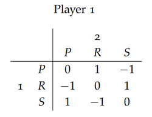

# Games
Games have:
- A number of agents (players) interacting with each other
- At the end of the game, every player receives a pay-off
- Clearly defined rules for what the players can do

Randomness in games can be solved with a third player, **nature**.

**Imperfect information** & **simultaneous moves** can be wrapped in a bubble.

A **fully specified strategy** defines what a player should do in every single possible situation.

A **pure strategy** - defines which choices a player should make on each level of the subtree.
Exactly one of the available moves to the player is in the subtree.

A game with **perfect information** has information sets of size 1.
Information sets are the box around, e.g. RPS in RPS.

# Normal Form
Normal form is a table of every strategy from the players with the respective payouts for each combination.

A strategy is winning if all of its payoffs are > 0, and ensures a draw if its payoffs are ≥ 0.
**Zermelo's theorem** is that in a zero-sum, 2P, finite, perfect info, no chance, either:
- P1 has a winning strategy
- P2 has a winning strategy
- Both players can ensure a draw

# Equilibria
A **best response** is a strategy which has the greatest payoff out of your strategies, considering your opponents strategies.

A **Nash equilibrium** is when every players are playing a best response to another player.
It always exists for 2-player, zero-sum, perfect information games without chance.