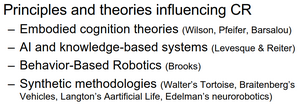
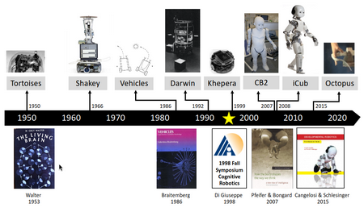
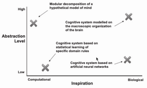

# W1 - Cognitive Robotics Examples
## Cognitive Robotics Examples
**Shape bias** - The biggest and most salient shape is the most obvious representation of an image.
**Cross-situational learning** - Learning how a word is used across situations to sharpen its definition.

### Chinese Room Experiment
The Chinese room experiment shows that the room operator can respond in Chinese without understanding the language.
Could contain:
- A dictionary of words
- A reply rulebook
- A input question
This ties to LLMs having zero understanding and only "instructions".

**Grounding** - Mapping words to the real world meaning, usually visually.
**Concrete words** - Words which represent an object concretely. (20%)
**Abstract words** - Words which cannot be mapped easily to one visual meaning. (80%)

Child learning process:

**Fast-mapping** - Where a robot learns from a single encounter, mirroring learning in children.
**Scaffolding** - Support learning of, e.g. a child, by simplifying the process.
- Using shape bias to name an object to the child
- Simplifying language to cut out filler in instructions

## Introduction to Cognitive Systems
_note: missed 15 min of lecture 2_

"**Cognitive robotics** - The field that combines insights and methods from AI, as well as cognitive and biological sciences, to robotics."
**Artificial Cognitive Systems** - Modelling of simulated and embodied/robotic agents taking inspiration from natural and cognitive systems
**Intelligent Robotics** - Engineering approach to the design of intelligent capabilities in robots using any AI methods, not psychology

Reading:

Cognitive robotics was first used as a word in '98.

Cognitive systems can be described with:
- Computational / bio-inspired spectrum
- Level of abstraction in biological model
