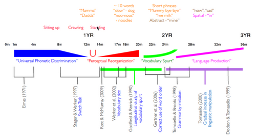

# W1 - Cognitive Robotics Examples
**Shape bias** - The biggest and most salient shape is the most obvious representation of an image.
**Cross-situational learning** - Learning how a word is used across situations to sharpen its definition.

### Chinese Room Experiment
The Chinese room experiment shows that the room operator can respond in Chinese without understanding the language.
Could contain:
- A dictionary of words
- A reply rulebook
- A input question
This ties to LLMs having zero understanding and only "instructions".

**Grounding** - Mapping words to the real world meaning, usually visually.
**Concrete words** - Words which represent an object concretely. (20%)
**Abstract words** - Words which cannot be mapped easily to one visual meaning. (80%)

Child learning process:
