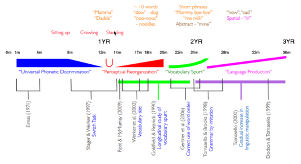
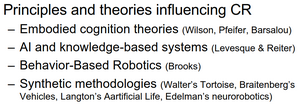
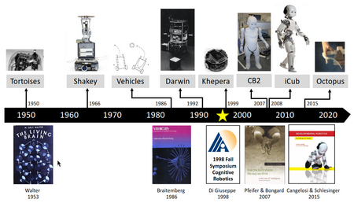
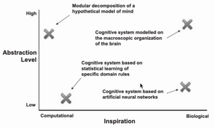

# W1 - Cognitive Robotics Examples
## Cognitive Robotics Examples
**Shape bias** - The biggest and most salient shape is the most obvious representation of an image.
**Cross-situational learning** - Learning how a word is used across situations to sharpen its definition.

### Chinese Room Experiment
The Chinese room experiment shows that the room operator can respond in Chinese without understanding the language.
Could contain:
- A dictionary of words
- A reply rulebook
- A input question
This ties to LLMs having zero understanding and only "instructions".

**Gavagai problem** - Referring an object with a word is naturally ambiguous. Which part of the object is that word? In what way?
**Grounding** - Mapping words to the real world meaning, usually visually.
**Concrete words** - Words which represent an object concretely. (20%)
**Abstract words** - Words which cannot be mapped easily to one visual meaning. (80%)

Child learning process:

**Fast-mapping** - Where a robot learns from a single encounter, mirroring learning in children.
**Scaffolding** - Support learning of, e.g. a child, by simplifying the process.
- Using shape bias to name an object to the child
- Simplifying language to cut out filler in instructions

## Introduction to Cognitive Systems
_note: missed 15 min of lecture 2_

"**Cognitive robotics** - The field that combines insights and methods from AI, as well as cognitive and biological sciences, to robotics."
**Artificial Cognitive Systems** - Modelling of simulated and embodied/robotic agents taking inspiration from natural and cognitive systems
**Intelligent Robotics** - Engineering approach to the design of intelligent capabilities in robots using any AI methods, not psychology

Elements of CogRob:
**Embodied cognition** - The body plays a critical role in cognitition, e.ggg. a passive walker using leg structure instead of motors.
**GOFAI** - Classical symbolic AI, reasoning and planning, sense-plan-act.
**Behaviour-based** - Noted but its just sense-act cycles.

Reading:

Cognitive robotics was first used as a word in '98.

Cognitive systems can be described with:
- Computational / bio-inspired spectrum
- Level of abstraction in biological model

**Cognition** - The process by which an automous system perceives its environment, learns from experience, anticipates the outcome of events, acts to pursue goals, and adapts to changing circumstances.
Cognitive systems host two main cycles:
- Act -> Perceive -> Act
- Anticipate -> Learn -> Adapt -> Anticipate

**Marr's level of abstraction** applies to all disciplines of computer science, not just CogRog. They are:
- Level 1 - Theory/computational. "What is the phenomena we're representing, and why?"
- Level 2 - Algorithmic. "How can it be represented as a process with inputs and outputs?"
- Level 3 - Implementation. "How is it implemented?"