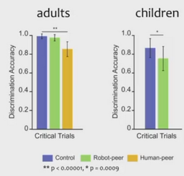

# W10 - Social Robots
## Psychology of Social Robots
By nature, humans will attribute human-like characteristics to artefacts.
**Pareidolia** - Perceiving human-like features in non-human stimuli.
Robots are designed to evoke anthropomorphisation.

### Conformity
Two kinds of social pressure:
**Informational** - Uncertainty, so following what others do.
**Normative** - Entirely influenced by others.
Would robots exert peer pressure? Not nearly as much as humans do to adults. To children though, they do.

This is powerful for learning.

## Robots in Education
Pros of robots:
- Learning is socially gated
- Physical presence compared to info on a screen
- One-to-one tuition
- Cognitive and affective (enjoyment) benefits
- Benefits for the neurodiverse
Studies show that learning outcomes are close to that of a human tutor.

Language learning is particularly catered to robot education over traditional means.
A study took place in the Netherlands with non-adaptable robots. The results were:
- Learning was very slow.
- No advantage for robot teaching over tablet teaching.

**Audiovisual speech** is about visualising the mouth movements while speaking to aid pronunciation.
Results showed that this did not help with 2nd language pronunciation learning. However, they do help with a language you are familiar with.

## Autonomous Social Robots
These robots are extremely difficult to build.
Speech recognition was "solved" when it came to clear, adult, American English. Which is quite a restriction.
Now, OpenAI's Whisper is the state-of-the-art model now, able to transcribe in real time in difficult situations.
LLMs are extremely powerful in low-data languages.