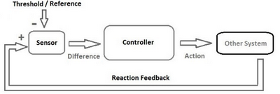
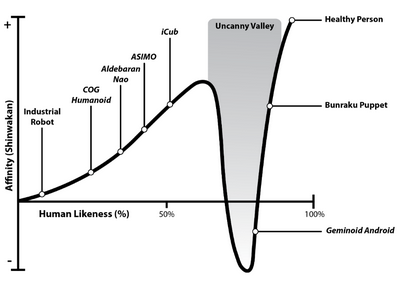
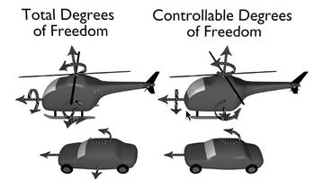
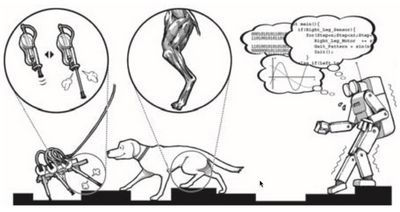

# W2 - History and Sensors
## Robotics History
- Waldo (1945) developed in WWII, master-slave manipulator
- Unimate(1961), the first robot sold at General Motors
- Shakey (1960s), the first cognitive robots
- Roomba (1990s), the first commercial robot1

Weiner's Cybernetics (1948) proposes the principle of self-regulation, continuously correctly the system based on what it senses.

Walter's Tortoises (1948) contained two conditional Pavlov circuits where the robot associates a neutral stimulus with a significant one.
Braitenberg's Vehicles (1986) added a psychological aspect, with emotion, behaviours based off them, etc.

### Types of Robots
**Robot** - An autonomous system which exists in the physical world, can sense its environment, and act on it to achieve a goal.

**Humanoid** - Has anthropomorphic body plan and actuators with human-like senses for human interaction.
**Android** - Designed with the intention of being indistinguishable from humans in its appearance and behaviour.
It can be difficult to avoid the **uncanny valley** with androids.

## Sensors and Actuators
Robots generally contain:
- Sensors, to perceive the environment
- Effectors / actuators, to take actions
- Controllers, to be autonomous

### Effectors
**Effector** - Any device affecting the environment, e.g. legs, arms, wheels.
**Actuator** - Mechanism enabling effector to execute movement, e.g. mucles, motors.
**Joint** - An actuator connecting two body parts with at least 1 DOF.

**Holonomic** - Total DOFs $=$ Controllable DOFs
**Non-holonomic** - Total DOFs $\le$ Controllable DOFS
**Redundant** - Total DOFs $\ge$ Controllable DOFS

**Active actuator** - Uses energy to move the effector to desired position.
**Stiff effector** - Predetermined position and trajectory.
**Compliant actuator** - Responds to external force for safe HRI.
**Passive effector** - Exploit body-environment physics interaction using minimal energy, e.g. gliding.

### Embodied Intelligence
- Many animals exploit passive effectors and compliant effectors.
- Robots often inspired by biological systems for low energy consumption.

### Sensors
**Sensor** - Physical device to measure physical properties.
**Proprioception** - Internal quantities, e.g. battery, motor force.
**Exteroception** - External quantities, e.g. light, sound, temperature.
A robot will always be uncertain about the state of itself and its environment.

Levels of sensory processing:
- Low - Purely electronics, e.g. bump sensor.
- Medium - Signal processing, e.g. microphone, sonar.
- High - Computation, e.g. vision, NLP.
Vision in robots can be a form of active sensing.