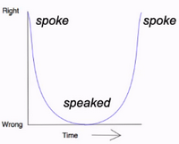
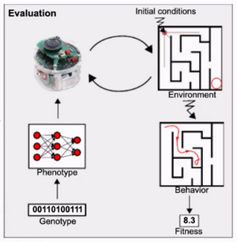
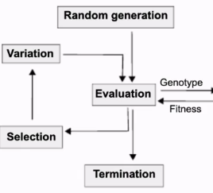
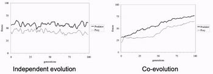
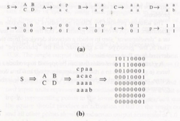

# W3 - Developmental, Evolutionary and Swarm Robotics
## Developmental Robotics
Developmental robotics takes direct inspiration from child psychology to design robots that develop their own intelligence and cognitive skills.
Robots' pathway to development is defined by their own intrinsic motivation.

Epigenetic robotics = autonomous mental development = developmental robotics

There are 6 principles of DevRob.

**Dynamical Systems** - Different systems work together to produce a common result, with no central thinking module.
- Decentralised system
- Self-organisation and emergence
- Multicausality
- Nested timescales

**Evolution and Learning** - Some skills must be learned early (e.g. language), and all learning builds on evolved structures.

**Embodied and Situated** - The mind develops from being in the world with a body, meaning comes from action, not symbols.

**Intrinsic Motivation and Social Learning** - The natural curiosity observed in infants to discover new things, particularly together.

**Non-linear, Stage Development** - Learning is not a straight line, and sometimes one may regress before advancing, even in a U-shape.

**Genetic epistemology theory** stages:
- Sensorimotor stage (0-2 yrs), the world is physical reactions of properties.
- Prepoperational stage (2-7 yrs), the world can be represented by descriptive words.
- Concrete operational stage (7-11 yrs), the world can be simulated in mind, e.g. tall glass of water vs big glass of water.
- Formal operation stage (12+ yrs), the world can be formalised into mathematics.

**Online, Open-ended, Cumulative** - Learning continuously while performing a task, with it all building up over time.

## Evolutionary Robotics
Evolutionary robotics automates robot design through an evolutionary computation process.

Divide and conquer, separate out perception, planning and action, each trained separately.

**Phenotype** - Body and behaviour
**Genotype** - The "DNA", encoding robot parameters

**Fitness** - A number computed as a result of evaluation on the input genotype.

Basically get a bunc h of random agents, have them perform the task, take the top x% performers, kill the rest, take the genotype of those x% and apply slight variation to get another batch of robots. Repeat.

Flipping bits in binary encoding has massive implications for leftmost bits.
**Grey-encoding** - Different mapping of real to bits, ensuring that any bit flip changes the result by a small amount, hence small mutations.

**Sim-to-real** - Conversion of a robot simulation to the physical real deal.
Noise can be added to the simulation to mimic the robot's real world sensors.

### Co-evolution
Competition means strategies need to adapt to each other, forcing them to become better than if they evolved independently.

No increased supervision.

Genotype-phenotype encoding can be done with grammar encoding.

This compresses the genotype down and adds structure within the network. (Kitano)

**Genetic Regulator Network** - Model DNA and protein-gene interaction, from 1-1 to many-many between genes and body attributes.

## Swarm Robotics
This is the study of how independent robots can interact as a group, giving rise to collective behaviour on a micro and macro level.

**Ant colony optimisation** - Ants like to follow the smell of other ants, making optimal paths become more attractive.

Requires a decentralised approach with limited communication.

Multi robot systems have higher degree of fault tolerance than a single robot, due to systems inherent redundancy.