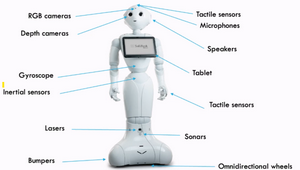
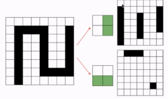
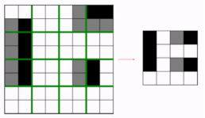

# W4 - Robotics Middleware

## Robot Software
Why humanoid robots?
- Can navigate a world built for humans
- Embodiment of intelligence
- Familiarity and other psychological reasons
- Able to do general tasks

Autonomous robot workflow - Sensing -> Reasoning -> Acting

### Softbank Pepper Robot
Intended to elevate people's quality of life, facilitating relationships, etc.

### Middleware
Sensors and actuators are not standardised, manufactured in different ways. There needs to be a way to interact with them.
**Middleware** - A software layer connecting the hardware and an application.
- Modularity
- Reconfigurability
- Reduced coupling
- Language independent

**Robot Operating System (ROS)** - Open-source, most widespread middleware in industry. Uses a publisher-subscriber node system.
**Yet Another Robot Platform (YARP)** - Used for iCub, smaller community, similar to ROS.
**NAOqi** - Proprietary software used for Softbank robots like Pepper, usable in Python.

**Choregraphe** - Software which uses block programming to design robot logic.

## Cognitive Vision
Most problems in robotics are vision problems.

### Neural Networks
**Feedforward NNs** moves information in one direction, from one layer to the next.
**Shallow NNs** have 2-3 layers, while deep ones have more.
Transformers are a type of feedforward network, while the core issue which LLMs tackle is a recurrent network problem. This task is converted to be feedforward.

### Hyperparameters
**Dropout** is randomly deactivating neurons during each training minibatch to avoid overfitting.
**Data augmentation** is changing the data in simple ways to improve generalisation, e.g. flipping images, adding noise.
There's also number of layers / hidden neurons, learning rate, momentum, regularisation, etc.

### Datasets
**MNIST** - 28x28 grayscale, 70000 images of handwritten numbers.
**CIFAR-10** - 32x32 colour, 60000 images of 10 classes of objects.
**CIFAR-100** - ^ but 100 classes.

### Convolutional Neural Networks
Instead of being fully connected, CNNs use **receptive fields** to filter elementary features.

These filters are convolved over the input, which activate neurons in the corresponding feature maps.

**Pooling** reduces the spatial resolution of feature maps. E.g. **Max** pooling always takes the maximum value in the filter.

A CNN could consist of something like input -> (convolution -> pooling) -> fully connected -> softmax.

### Recurrent Neural Networks
Best for time series tasks, like captioning, word prediction, and such. We know what an RNN is.