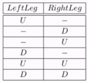
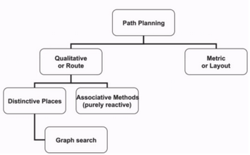
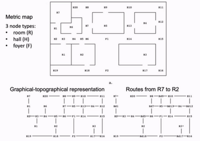
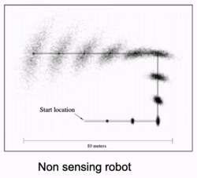
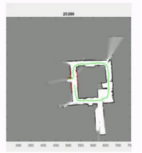
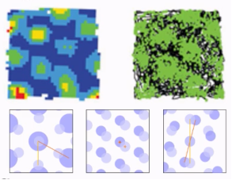
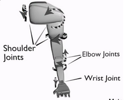
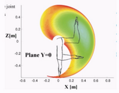
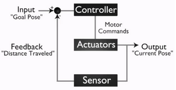
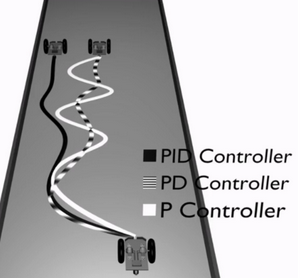

# W9 - Navigation and Manipulation

## Navigation and Locomotion
**Navigation** - Moving entire robot from one location to another.
Options:
- Mechanical locomotion (e.g. wheels)
- Biomimetic locomotion (e.g. crawling, sliding)
- Legged locomotion (number of leg events $=(2k-1)!$)

**Gait** - Precomputed coordinated movements.

### Path Planning
**Qualitative path planning** - Topological route with distinctive landmarks / asssociations, from agent's perspective.
**Quantitative path planning** - Metric navigation with a bird's-eye-view map, independent of orientation and position.

### Topological Navigation
**Distinctive places** - Using easy to recognise landmarks as waypoints.
**Associative methods** - Reacting to perceptual state of the environment.
The world can be represented by a relational graph of nodes (landmarks) and edges (navigable paths).

Challenges:
- How to build the map of a new world?
- How to recognise where you are?
- How to explore new areas?
- How to label the map with features?

**Mobile robot localisation** - Determining the position and orientation of a robot relative to its environment.
**Marcov localisation** - Used for global localisation without initial known pose, through known environment features.
**Extended Kalman filters** - Used for local localisation to predict what the robot will sense before the action.
**Iconic localisation** - Raw sensor readings to match actual observations to expected observations. High computation. Puts poses within polygons.
**Monte Carlo localisation** - Particles (sample poses) scattered through space, compute probability of robot at each pose. Low value particles die.

### Simultaneous Localisation and Mapping (SLAM)
This is the state of the art. SLAM builds a map whilst localising using LIDAR.
- Each particle presents a path and a local map.
- Each observation updates only the sensed area of the maps and computes belief in each particle.
- Use tree to save particles which form history of current particle set.
- Loops can be closed when you find the same place through a new path.

**Visual SLAM (vSLAM)** - Instead of LIDAR, use cameras, extract features, and track them.

### Cognitive Navigation
**RatSLAM** - Emulating the spatial navigation ability of a rat.
- Less accurate than SLAM.
- Cope with noisy input.
- Deal with changing environments.

**Place cells** fire when the rat is at a specific location in the environment - recognition of familiar place.
**Head direction cells** fire when the rat's head is at some orientation.
**Grid cells** fire in a metrically regular way across the surface of a given environment.

Some cells have higher resolution of the environment than the other. These let the rat know how far it moves.
**iRat** - Silly little robot which aims to navigate like rats.
**OpenRatSLAM** - Open-source RatSLAM with bindings to ROS.

## Manipulation
**Manipulation** - Moving body part to manipulate the environment.
**Robotic manipulator** - One or more links connected by joints, and the endeffector.
**Endeffector** - Used to affect and move objects in the environment.

**Joint limit** - The range in which a joint can move.
**Workspace** - The set of all poses attainable by an endeffector.

A human arm has 7 DOF - 3 shoulder, 1 elbow, 3 wrist.

**Kinematics** - Computing the effector motion based off actuator motion.
**Inverse kinematics** - Computing the actuator motion based of desired endeffector position.
**Dynamics** - The properties of motion and energy of a moving object.
Slow-moving robots are not very impacted by dynamics. Fast-moving robots are impacted.
**Compliance** - The level of yield to environment forces.
Important for safety with humans. Implemented with springs, soft materials, software.

### Control
There is always some level of **actuator uncertainty**.
**Closed loop** control (feedback):
- Achieve a desired state.
- Continuously compare current state with desired state.
- Maintain the state by correcting the error.

**Open loop** control (feedforward) doesn't perform any check, just predicts what will happen.

Types of feedback control:
- **Proportional control** (P) - System responds in proportion to the error.
  - Gain determines magnitude of the response.
  - Oscillation is the undershoot or overshoot of desired state.
  - Damping is the process of decreasing oscillation.
- **Derivative control** (PD) - Error signal added with the derivative of the error signal.
  - Solves gain/oscillation problem.
  - Correct the momentum as the system approaches desired state.
- **Proportional integral control** (PID) - System integrates incremental errors over time.
  - No steady state errors.
  - When some threshold of cumulative error is reached, the system will compensate.

### Cognitive Manipulation
U-shaped development is observed in how babies reach for objects.
- 0-2 months - prereaching
- 2-3 months - decline of prereaching
- 3+ months - reaching with grasp preshape

Evolutionary robot reaching model:
- Initial training with low-acuity visual input.
- As visual acuity improves, percent of prereaching declines.
- With experience, reaches become straighter.

Visually guided reaching:
- Direct gaze towards target (foveate).
- Learn mapping eye position to arm movement to target.
- Learned outcome is to gaze at the hand and fixate the hand.

### Deep Learning for Manipulation
Deep Q reinforcement learning:
- Rewarding positive outcomes and punishing negative outcomes.
- Random target reaching and door opening.
- Parallelising across multiple workers.
Hand-eye coordination for grasping:
- 14 robots in parallel.
- CNN for grasp prediction with 800000 grasp examples.