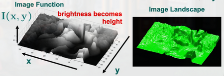
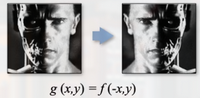
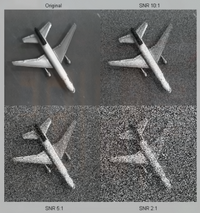
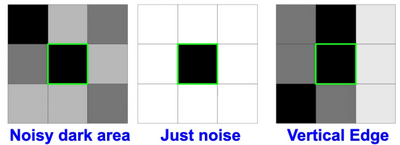
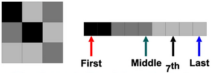
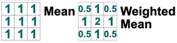
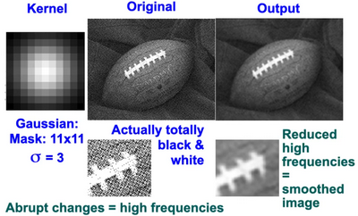
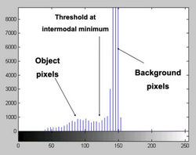
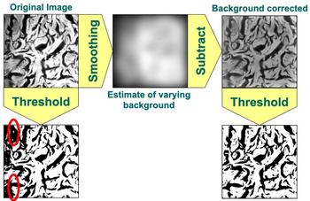

# W1 - Image Basics
## Live Lecture
TODO

## Digital Images Basics
### Image Representation
**Grey-level** - Value of a pixel
Images can be represented as:
- Image function
- Landscape
- Array of pixels
- Image histogram

**Image function** - $I(x,y)$ gives the intensity of a pixel at a point, discretely.
**Landscape** - Uses the image function and smoothens out the surface. Allows for continuous computation.

**Array of pixels** - Stores brightness in each cell.
**Image histogram** - Sort pixels by gray-level values. Loses spatial information.

### Grey-level Processing
As with any function, operators can be applied to images.

Noise is always present in images. Identical images will not have identical values due to device flunctuations.
It is difficult to tell between noise and real small-scale image changes.
**Grey resolution** Is the word legth of each pixel.
**Signal to Noise Ratio** - $SNR = \frac{\text{max signal}}{\sigma_{noise}}$ assuming noise is normally distributed.

Noise is reduced when averaging the same images.
$\sigma' = \frac{\sigma}{\sqrt{N}}$ where N is the number of images being averaged.
Noise is preserved when subtracting the same images from each other.

**Spatial averaging** - Replace centre value with average in AxB neighbourhood, a window. This blurs edges.
**Sub-sampling** - Throw away some rows or columns of an image to reduce the resolution of an image.
By averaging before sub-sampling, we can ensure that small-scale structure noise is removed.

## Neighbourhood Processing
Considering a pixel value in context of its neighbours, you can estimate whether it is noise or not.

### Rank Filtering
Order the values within the filter window.
The output becomes either:
- First value, causing erosion (increase dark spots)
- Last value, causing dilation (increase light spots)
- Middle value, median filtering (preserves edges)

Median is optimal for salt and pepper noise, while not blurring edges.

### Convolution
This is a type of **linear filtering**.
We should account for the spatial patterns within windows.
The window can have weights dedicated to each pixel:

> Windows == Kernels == Masks
$\tilde{I}=I*g$, where g is the weighted window.

**Padding** - Expanding the image border to sweep over edge pixels, by:
- Setting all pixels to a constant border colour
- Reflecting pixels across the image edge

**Gaussian kernels** blur an image according to the size of the kernel.

## Thresholding
**Segmentation** - Label each pixel as either object of interest or as background.
**Binary image** - Resultant image after threshold has been applied.
Threshold can be selected by observing the intermodal (between the peaks) minimum of the image histogram.

### Adaptive Thresholding
Useful where the background is not uniformly shaded, but the object of interest may still stand out.
The threshold cannot be any one value, and should vary.
1. Smooth the image to estimate how the background varies.
2. Subtract the smoothed image from original.
3. Apply threshold.
