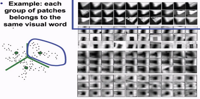
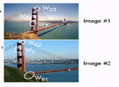
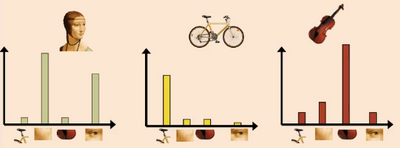
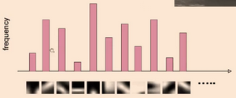
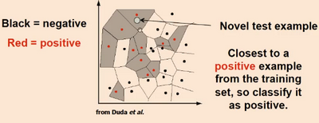
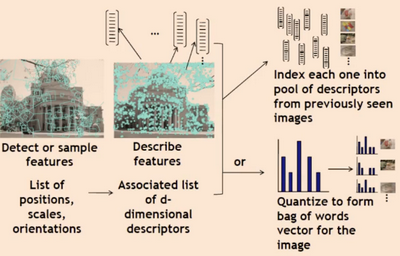

# W10 continued
By clustering, one must find some optimal visual vocabulary size.

Now for every word, the images where it appears in can be stored.

The images with the greatest share of visual words have the same content.

**Spatial verification** - Let each matched feature vote on location, scale, orientation of the model object, then verify parameters with enough votes. A final check on the matches.

To think about with visual vocab building:
- Where to extract features?
- How to quantise? (k-means?)
- Unsupervised or supervised?
- What corpus provides features?
- What vocabulary size to use?

Sample strategies include:
- Sparse, at interest points
- Dense, at uniform points
- Random
- Multiple interest operators to offer more image coverage

## Object Categorisation
Can this visual vocabulary be used to recognise ANY car, instead of a specific car?
Humans too categorise objects before specifiying them.
**Functional categories** - An set of objects performing the same job, e.g. "chair".

This means a category representation must be robust to:
- Intra-category variation (dog breeds)
- Deformation, articulation
- Etc.

## Bag of Words Representation
One can do BoW to images as they would to a document to identify category-level characteristics.
E.g. a human's face BoW could contain words for mouth, eye, nose, chin, etc.

BoW has independent features, and a histogram representation of features for each object class.

The idea is to check for high frequency and cooccurence of notable visual words.
Per image, we have a vector representation of a fixed size, being the vocabulary size. Vectors are easily comparable.

Then, one can run training on this data where categorised images are converted into this representation.

### Category Decisions
Two methods:
- **Generative** - Gives a probability on the image under the condition that its some category.
- **Discriminitive** - Any machine learning classifier, giving a yes / no answer based on some boundary.

### Discriminative Methods
**Nearest-neighbour classification** - Divide input space into points.

**K-nearest-neighbour classification** - Find the k closest points from training data. The labels of the points vote to classify, e.g. if 3 negatives and 2 positive, it's classified as negative.

- Simple to implement
- Flexible to feature choices
- Multi-class handling
- Large search problem
- Data storage issues
- Must have a meaningful distance function

### Generative Methods
**Naive bayes model** - Assume each feature is conditionally independent given the class.
"Given the class is car, the probability of observing these words together is the same as them separately, multiplied together."
This method was dominant until deep neural networks.

Bag-of-words cons:
- Ignores geometry entirely, how words relate to each other.
- Background and foreground gets mixed in words.
- Interest points have no guarantee to capture object-level parts.
- Optimal vocabulary formation is unclear.