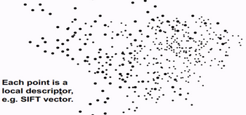
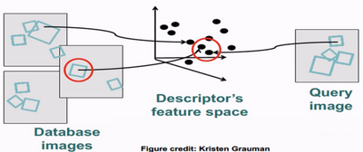
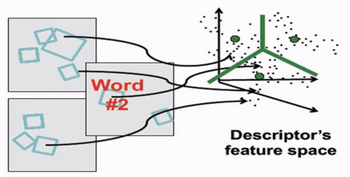

# W10 - Object Recognition

## Indexing Local Features
With thousands of features per image, and millions of images to search, matching an object is a high computation task.
For text, an efficient way to find pages where a word occurs is with an index. To use this idea, we map features to visual words.

When querying an image, one can match its features to the known points in the feature space.
Certain combinations of features map to different database images.

One can **quantize** the feature space by mapping tokens to clusters of close descriptors.
