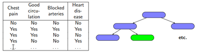
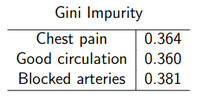
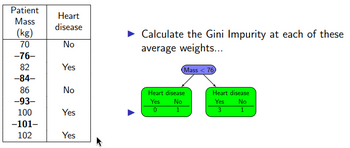
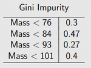
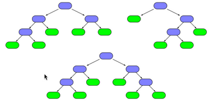

# W11 - Face Detection

## Decision Trees
Decision trees can be made for simple classification problems with discrete variables.

Example: Which variable should be the root node? The one which best predicts the result alone.

### Gini Impurity
**Gini impurity** - A measure to determine how well a variable determines a result by itself.
$\text{Gini} = 1-p_y^2-p_n^2$
Lower = Less impurity.

Gini impurity needs to be recalculated for child nodes, once a root is picked.

To handle continuous values, one can fill in values between each sample and calculate the Gini impurity for each.

We can then pick the lowest one - the one which divides the data the best.

### Random Forests
Decision trees are not very accurate.
Solution: Make a **bootstrapped dataset** which copies samples from the original into a new dataset of the same size.
Once a root is chosen, a random set of the remaining variables are also chosen to fill out the rest of the tree.
Repeat this hundreds of times, now we have a random forest.

This forest votes on each new data point, and the most likely category is chosen.

## AdaBoost
**Adaptive boosting** - ML technique combining simple decision trees into a single, more accurate model. Each portion targets the mistakes made by previous, combining with a weighted vote.

Instead of a forest of trees, AdaBoost uses a **forest of weighted stumps**.
Each sample is given a weight of importance to classify right - by default equal.
The algorithm iterates:
- Use Gini impurity again to select the first stump (instead of root of tree).
- Error of each stump is the sum of incorrect sample weights.
- Store the say for this stump, $\text{say} = 0.5 \times \ln(\frac{1-\text{Error}}{\text{Error}})$
- Update sample weights so that misclassified samples are higher priority.
- If incorrect, $w' = w \times \text{Error}^{\text{say}}$
- If correct, $w' = w \times \text{Error}^{-\text{say}}$
- A new stump is created by looking at Gini impurities again.

To classify using a forest of stumps, just sum their amount of say during voting.

## Face Detection