# W2 - Edges and Convolution
note: missed part 1 and 2
## Edge Detection
Edges are produced by:
- Depth discontinuity
- Surface colour discontinuity
- Illumination discontinuity

Edges correspond to the image intensity first derivative extrema, or second derivative zero-crossings.

First derivative filter:
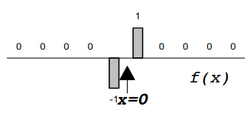
Result of applying a filter to an edge:
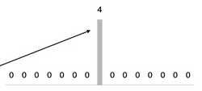

Second derivative filter:
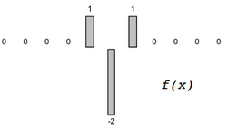
Result of applying the filter:
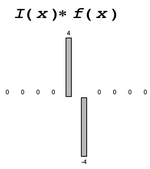

This edge detection is extremely sensitive to noise. It can be mitigated by pre-smoothing.
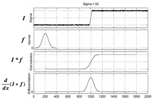

## Kernel Edge Detection
**Prewitt Kernel** - Kernel which detects edges along an axis and performs some smoothing.
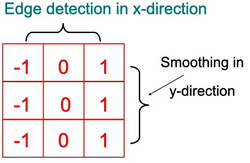
The Sobel Kernel performs weighted smoothing (1, 2, 1).
These produce derivative images for both axes, $I_x, I_y$.
**Edge Magnitude** - $\sqrt{{I_x}^2 + {I_y}^2}$
**Edge Direction** - $\tan^{-1}{\frac{{I_x}}{{I_y}}}$
These kernels are separable, in that they can be implemented as a cascade of 1D convolution.
For the Sobel Kernel:
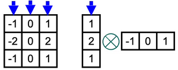
This means we go from $n \times n$ to $2 \times 1 \times n$ convolutions.

## Gaussian Edge Detection
### Canny Edge Detection
With a Gaussian mask, usually the insignificant edges of the distribution are cut off.
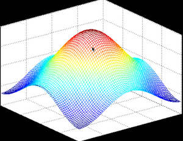
- Good for anti-aliasing
- Kernel is separable by x and y
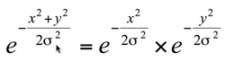
This allows use to do a cascade of 1D convolutions instead.

**Canny Edge Detector** - Use Gaussian smoothing to select scale, then do edge detection.
Edge detection at larger scales is more reliable.
Differentiation is convolution, and convolution is associative:
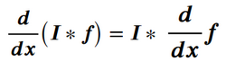
Meaning we can instead convolve with the derivative of the Gaussian, along the two axes.
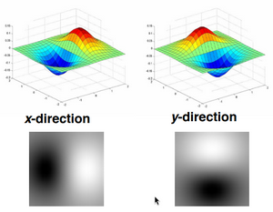

By itself, this produces thick edges. Finding the strongest edge pixel is a 2nd derivative problem.
**Thinning** - Non-maxima of an edge can be suppressed.
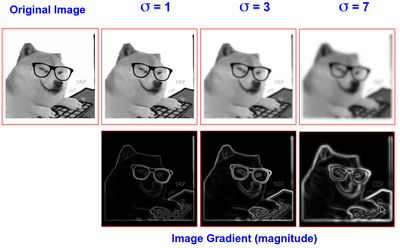

### Laplacian Edge Detection
**Laplacian Kernel** - Second derivative kernel. It produces zero-crossings, without edge direction.

Laplacian of Gaussian:
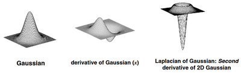
