# W3 - Hough Transform and Segmentation
## Generalised Hough Transform
### Cartesian Hough Lines
These are used to find lines in an edge-detected image.
Parameter space linear equation: $c = -xm + y$, so $-x$ is the gradient, and $y$ is the intercept.
We can plot a line onto parameter space for every point in the image, and see where they cross.
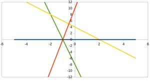
The graph above has $m$ on the horizontal axis and $c$ on the vertical axis.
Crossings of more than 2 lines are of interest, meaning more than 3 points fall in a line in $xy$ space.
We can create the parameter space discretely with a 2D accumulator array. This allows us to pick points which are "near enough".

### Polar Hough Lines
The problem with the Cartesian system is that a line can be vertical and its $m,c$ undefined. We can use polar coordinates instead.
$r = x\cos{\theta} + y\sin{\theta}$, and again we fit a curve in the $r, \theta$ parameter space.

### Hough Circles
We can use Hough circles to find the centre of points arranged in a circle.
Consider all circles which can go through a point.
$(x - a)^2 + (y - b)^2 = r^2$
becomes
$(a - x)^2 + (b - y)^2 = r^2$
such that the parameters are $x, y$.

In the parameter space / accumulator array, circles are drawn instead of lines / curves.
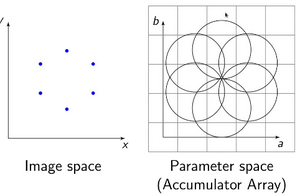
Where there is a crossing in parameter space is where there is a circle in image space passing through many points.
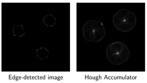
To find circles of any radius, as well as configuring $a,b$, we need a 3D accumulator array for $a,b,r$.

### Generalised Hough Transform
Instead of fitting for lines and circles, we can try to look for any arbitrary shape.
Pick a reference point within the shape, $x_c, y_c$.
Each $(r, \alpha)$ is the information needed to get from $x,y$ to the reference point.
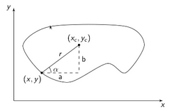
To model the template shape, we use the **R-table**:
- Consists of a range of edge angles, $\phi$
- For every contour pixel, the edge gradient $\phi$ and the $(r,\alpha)$ is appended to the R-table
- Using $(r, \alpha)$ pairs, a centre can be calculated
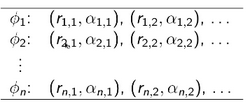
Using this information, we can take every edge pixel in the image, its gradient direction, and again use an accumulator array to find points which are likely centres.
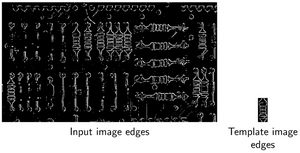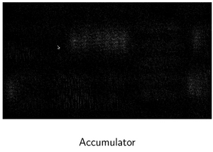
This can then be thresholded to give a yes or no answer on a shape appearing.

## Segmentation
### Grouping
Goal: Group similar image features together.
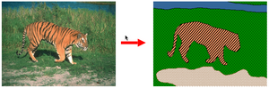
Used for auto-selection, background blur, social media stickers, etc.

Grouping is not always so easy. Elements in a collection can have properties arising from relationships.
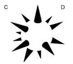
This leads to **Gestalt psychology**,  where "the whole is greater than the sum of its parts".
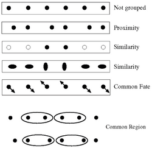

**Top-down** - Pixels belong together because they are from the same object.
**Bottom-up** - Pixels belong together because they look similar.

We can obtain a ground truth through human segmentation, but this is not an objective process.
By repeating this multiple times and overlaying them, some edges will be stronger than others.

**Superpixels** - Oversegment an image and then draw your overlay onto it.
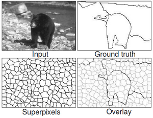
This ensures that edges will not overlap.

### Clustering
Goal: Label pixels with what they belong to.
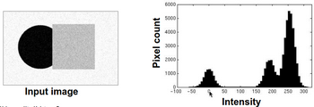
Could choose 3 colours as representative intensities.
The best colours minimise sum of squares distance for points being assigned to their closest colour.
**K-means clustering** - Randomly initialise the cluster centre colours, compute the clusters, compute new centres, and repeat.
This will always quickly converge to a local minimum.

Disadvantages:
- Must specify K
- Sensitive to initial centres
- Sensitive to outliers
- Detects spherical clusters only

Our feature space doesn't have to be 1D (just intensity), it can be 3D (e.g. RGB).
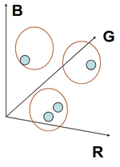
Even position (x, y) can be included in the feature space, to incorporate proximity into clustering.