# W4 - Advanced Segmentation
## Probabilistic Clustering
**Gaussian Mixture models** - Clusters are modelled as Gaussians, with data being assigned to a group with some probability.
**Univariate normal** - The regular 1D normal distribution, with $\mu$ and $\sigma$.
**Multivariate normal** - A multi-dimensional normal distribution, with a vector point $\mu$ and symmetric positive definite covariance matrix $\Sigma$.

Covariance matrix can either be:
- Spherical, where terms are equal.
- Diagonal, where terms are inequal.
- Full, where ?? it starts spinning/
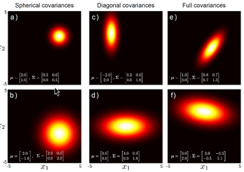

**Generative model** - Assume that a sample of data are generated by sampling a continuous distribution.

**Mixture of Gaussians** - Pick K Gaussian blobs with parameters $\theta$ and fit them over the points.
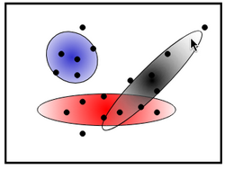

### Expectation Maximisation
1. E-step - Given current blobs, compute ownership of each point.
2. M-step - Given ownership probabilities, update blobs to maximise likelihood function.
**E-step** - The probability of point $x$ fitting into blob $b$ is computed by taking:
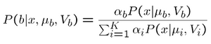
This is saying it's the output of the distribution of interest / the output of all distributions at that point.

**M-step** - Compute new parameters for blob $b$.
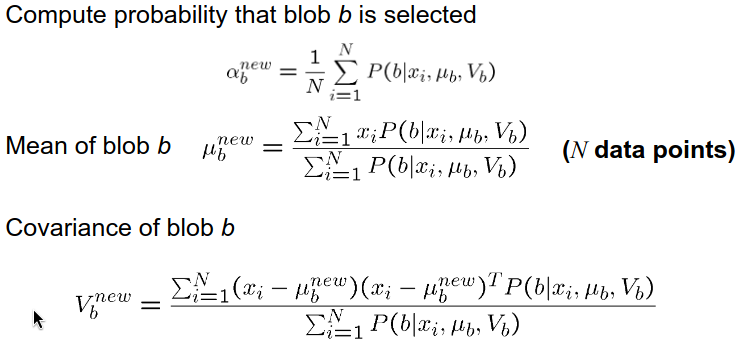

Pros:
- Probabilistic interpretation
- Soft assignments between data and clusters
- Generative model, can predict new data points
- Compact storage
Cons:
- Local minima (again)
- Initialisation is hard
- Know number of components in advance
- Choose generative model

## Model-free Clustering
**Mean-shift segmentation** - A technique to find modes (local maxima) in a distribution (in a feature space).
1. Initialise random seed to position windows W.
2. Calculate the centre of gravity ("mean") of W.
3. Shift the search window to the "mean".
4. Repeat until convergence.

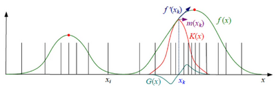
The density estimate can be obtained by convolving the kernel $K(x)$, and its derivative $G(x)$, producing the mean shift vector.
This is the direction that the current mode estimate $x_k$ must travel to become better.

One can tesselate the space in many windows to begin with, recording which points have fallen under a window.
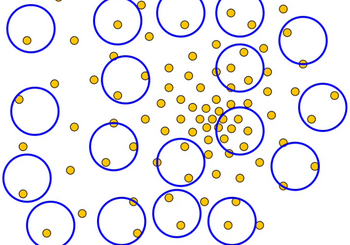

**Attraction basin** - The region where all trajectories lead to the same mode.
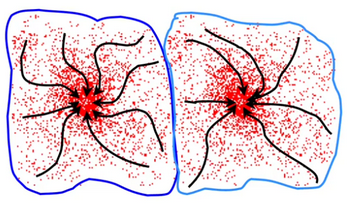
The basins form clusters.

Pros:
- Model-free, no assumption on cluster shape
- A single parameter (window size h)
- Find variable number of modes
- Application-independent tool
- Robust to outliers

Cons:
- Output is dependent on window size
- Computationally expensive
- Doesn't scale well with higher dimensions

## Graph Theoretic Segmentation
Images can be represented as graphs, where each node is a pixel.
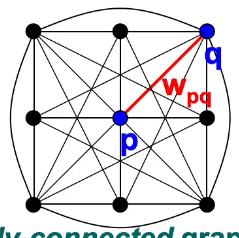
Every edge is an affinity weight.
**Affinity** - The similarity measure between pixels. Inversely proportional to difference.

One can break a graph into segments by beginning with a fully connected graph, and breaking links with low similarity / crossings.
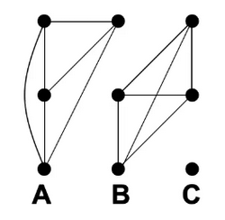

A weighted graph can be represented by a square, symmetric matrix.
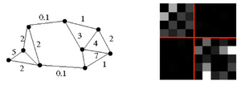

A cut can be easily made to the graph based on the matrix, to segment it.

Measures of affinity:
- Distance
- Intensity
- Colour

Affinity sensitivity is controlled by $\sigma$, where small $\sigma$ groups nearby points and large groups far-away points.
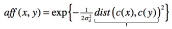

### Graph Cuts
**Graph cut** - Set of edges whose removal disconnects a graph, with a cost associated.

**Minimum cut** - Always cut the smallest cut cost. Issue is that the cost will be biased towards low-number cuts.

**Normalised cut** - Normalising the cost and cutting the minimum.
$Ncut(A,B) = \frac{cut(A,B)}{assoc(A,V)} + \frac{cut(A,B)}{assoc(B,V)}$
$assoc(A,A)$ is the sum of all weights within a cluster.
$assoc(A,V)$ = the sum of all weights within a cluster and within the cut.

Pros:
- Generic framework, flexible choice of functions for affinities
- Does not require any model of data distribution
Cons:
- Time and memory complexity can be high
- Many affinity computations

**GrabCut** - Allowing the user to select region of interest, performing segmentation, and running a foreground-background model over it, going back and forth until convergence.

### Segmentation Evaluation
$F  = \frac{2PR}{P+R}$
Precision $P$ - Percentage of marked boundary points which are real ones.
Recall $R$ - Percentage of real boundary points that were marked.