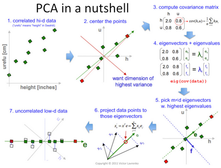
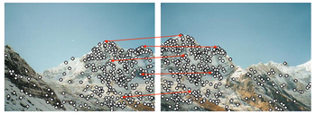

# W5 - PCA and Local Features
### Principal Component Analysis
PCA is a dimensionality reduction technique, transforming high-dimensional, correlated data into principal components.
**Principal components** - Uncorrelated variables with maximum variance from PCA.

The idea is basically to project points onto a line of best fit, $V_1$, with minimal variance along its perpendicular, $V_2$.
The lower the $V_2$ variance, the less information lost.

some about eigen whatever
### Active Shape Models
ASMs iteratively deform to fit shapes which change in their inner features in ways a transform cannot represent.

generative shape models somehting

Once you have an ASM, it fits to the shape like so:
1. Begin with the mean shape.
2. Calculate normals to the model curve at each point.
3. Search along the normal for the strongest edges.
4. Update the model to fit to this set of edges the best it can.
5. Repeat until convergence.

## Local Features
### Local Invariant Descriptors
**Feature** - Local, meaningful, detectable part of an image.
- High information
- Invariant to view point, illumination
- Reduces compute

Applications of features:
- Visual simultaneous localisation and mapping
- Image matching
- Image stitching
- 3D reconstruction
- Motion tracking

1. Find a set of distinctive keypoints
2. Define a region around each keypoint
3. Extract and normalise the region content
4. Compute a local descriptor from the region
5. Match local descriptors together

Requirements:
- Region extraction must be repeatable
    - Invariant to transformations
    - Covariant to out-of-plane transformations
    - Robust to lighting variations, noise, etc.
- Robust to occlusion and clutter
- Need a sufficient number of regions over the image
- Regions should be distinctive
- Real-time performance