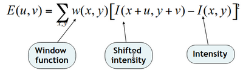
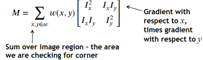
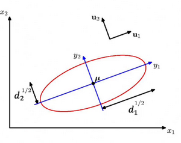
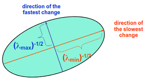
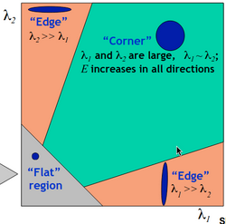

# W6 - More Local Features
## Local Interest Point Detection
Goal: Detect corners of objects, which have significant pixel change in multiple directions.

**Harris detector** - Output the change in intensity between two arbitrary points.

For small shifts, we can use the 2x2 matrix $M$:

$I_x$ is the image gradient with respect to x.

**Singular Value Decomposition** - Any $n \times n$ matrix $A$ can be written as $U \cdot D \cdot U^T$
$U$ is a unitary matrix, where its columns are orthogonal vectors and have unit length vectors.
$D$ is a diagonal, non-negative matrix.

The orthogonal vectors of $U$, $u_1, u_2$ are **eigen vectors.**
The diagonal values of $D$, $d_1, d_2$ are **eigenvalues**.

We can take the SVD of matrix $M$ to get the direction of largest variation and eigenvalues $\lambda_1, \lambda_2$.

Corners can be classified based on the values of these.

Corner response measure:
$R = det(M) - k(tr(M))^2$
Where:
$tr(M) = \lambda_1 + \lambda_2$
$det(M) = \lambda_1\lambda_2$
$k$ is a constant, around 0.05.
R is:
- Positive and large for a corner
- Negative for a large magnitude for one edge
- Small for a flat region

Window options:
- Uniform window, but the problem is that it's not rotation invariant
- Gaussian window, much better