# W6 - More Local Features
## Local Interest Point Detection
Goal: Detect corners of objects, which have significant pixel change in multiple directions.

**Harris detector** - Output the change in intensity between two neighbouring points.
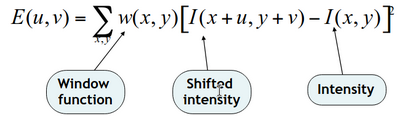

For small shifts, we can use the 2x2 matrix $M$:
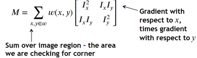
$I_x$ is the image gradient with respect to x.

**Singular Value Decomposition** - Any $n \times n$ matrix $A$ can be written as $U \cdot D \cdot U^T$
$U$ is a unitary matrix, where its columns are orthogonal vectors and have unit length vectors.
$D$ is a diagonal, non-negative matrix.
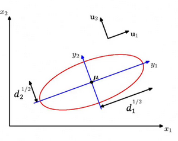
The orthogonal vectors of $U$, $u_1, u_2$ are **eigen vectors.**
The diagonal values of $D$, $d_1, d_2$ are **eigenvalues**.

We can take the SVD of matrix $M$ to get the direction of largest variation and eigenvalues $\lambda_1, \lambda_2$.
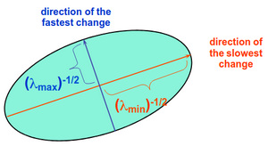
Corners can be classified based on the values of these.
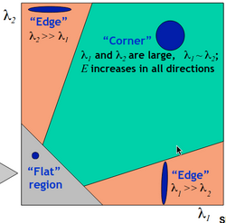

Corner response measure:
$R = det(M) - k(tr(M))^2$
Where:
$tr(M) = \lambda_1 + \lambda_2$
$det(M) = \lambda_1\lambda_2$
$k$ is a constant, around 0.05.
R is:
- Positive and large for a corner
- Negative for a large magnitude for one edge
- Small for a flat region

Window options:
- Uniform window, but the problem is that it's not rotation invariant
- Gaussian window, much better

## Scale Invariant Region Selection
How do we detect a region such that scale doesn't matter?

**Exhaustive search** - Vary the window sizes while comparing descriptors.
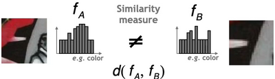
This is extremely computationally inefficient, just possible.

**Automatic scale selection** - The size of any region should be defined by maximising some response function.
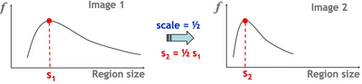
The scale inariant region size is found in each image independently.
Then, size normalisation can be done through rescaling.

The Laplacian is:
- Very noise sensitive
- Loses directional information
- Always combined with smoothing operation

It gets its maximum response when its scale fits the blob perfectly. This is the **characteristic scale**.
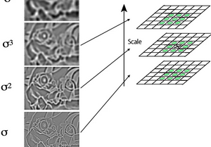
We can run LoG of different sizes on an image, and compare points of interest to their 26 neighbours on its level or other levels.
Local optima are noted down.
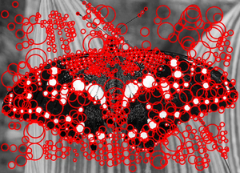

Combining Harris and LoG, we can choose regions from the Harris response, and only choose the scale based on LoG.
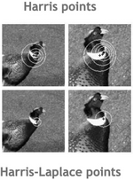

### Difference of Gaussians
LoG can be approximated with a difference of Gaussians (DoG). This allows us to skip computing 2nd derivatives.
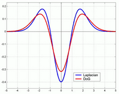

In DoG, there is a pyramid where Gaussian convolutions happen over and over.
Between each pair of Gaussians, the difference is taken.
Every **octave**, the image it scaled down as the small detail has been blurred out.
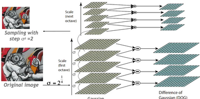