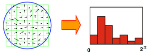
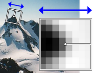
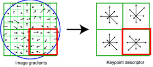
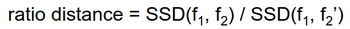
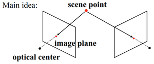
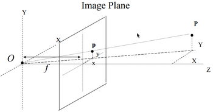
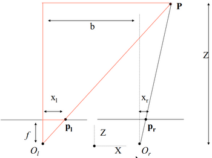

# W7 - Local Descriptors and Stereo Basics
## Local Descriptors
The simplest feature descriptor is a list of intensities in a patch.
This is highly impacted by rotational and intensity changes.

### Rotation Invariance
Instead, we could list intensity gradient directions in a patch. Magnitude is less important.

We can rotate each patch to have its dominant gradient direction point the same way.

### SIFT
**Scale invariant feature transform (SIFT)** - Feature location and scale using DoG, then compute histogram of image gradient orientations of pixels in region.
It divides a patch into subpatches, for which it computes the histogram for each with the 8 reference angles.

The resulting descriptor is 128D.
- Handles up to 60 degree 3D viewpoint changes
- Handles illumination changes
- Fast and efficient

### Comparing Descriptors
**Sum of square differences** - Compute SSD distance between descriptor entries. Can give good scores to ambiguous matches.
One can consider ambiguous matches by checking the distance ratio between two matches.

Values close to 1 should be considered more carefully, or the features should be discarded as misleading.
Features too far away, further than some threshold, should be thrown out.

Evaluation can be done with ROC (TP / FP).

### Applications
- Image alignment
- Panorama stitching
- Object recognition
- Motion tracking
- Robot navigation

## Stereo Basics
How do we recover 3D information from an image? We can use:
- Shading
- Texture
- Focus
- Perspective
- Motion

**Stereo vision** - Given multiple images of an object, compute its 3D shape.
This can be narrowed down to a calibrated, binocular pair of image sources.

Looking at one camera at a time:

We can separate the vector to point P into two triangles in the X and Y axes.

With two cameras, we can triangulate like so:

We end up with a depth formula:
$Z = \frac{bf}{x_l - x_r}$
Depth = baseline x focal length / disparity in image displacement
Images are projected into a new plane such that only depth in the x-axis matters. (?)

### Correspondences
To get point data in the first place, we need points from both images which match.
**Epipolar constraint** - Match for a given $x_l, y_l$ lies on the line $y_l = y_r$, if the camera is rectified to align with the baseline.

**Moravec operator** - An operator for corner detection. idk