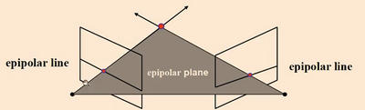
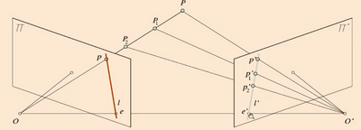
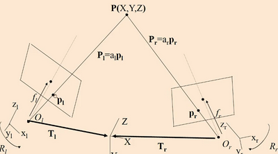
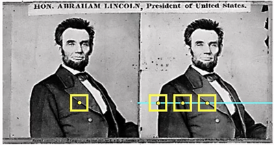
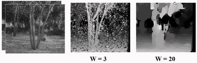
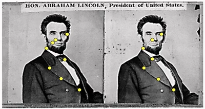
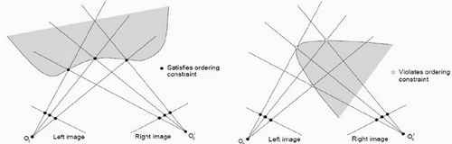
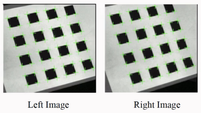

# W8 - Stereo

## Generalising Stereo Geometry
The general case refers to cameras which may be pointing in any direction, not aligned in certain axes.

The **epipolar plane** is formed between the cameras and the point of interest.
Epipolar lines are where the camera viewplane intersects with the epipolar plane.
**Epipoles** are where the baseline intersects the camera viewplanes.
If the cameras view in the same direction, the epipoles are at infinity as the baseline never intersects.

**Calibration** is simply determining the external camera parameters being their translation vectors, focal lengths, and orientation vectors.
Once these vectors are determined the real world vectors and coordinates can be calculated.
$P_l' = T_l + R_l P_l$
Where $P_l$ is $a_l p_l$, and $p_l$ is $(x_l, y_l, f_l)$.

Objective: Find where $T_l + R_l P_l = T_r + R_r P_r$
The world coordinate system can originate at one of the cameras to halve the parameters necessary.
The **essential matrix** solves this by relating the left coordinate system to the right coordinate system.

The cross product takes two vectors and returns another which is perpendicular to both inputs.
The essential matrix is the cross product between the translational and rotational matrices $E = [T_x]R$.

### Rectification
Image rectification is where we only want to deal with the parallel viewpoint case, and so project the images onto the parallel viewplane to make search easier.

## Correspondence Problem
To identify corresponding points, we have soft constraints:
- Similarity
- Uniqueness
- Ordering

### Similarity - Dense
For each pixel in image 1:
- FInd epipolar line in the right image
- Examine all pixels and pick the best match
- Triangulate the matches to get depth

If the image is rectified, the epipolar lines are horizontal scanlines.
Changing the window size from small to large will go from noisy to inaccurate.

Textureless regions and pixel occlusions (where pixels are removed because of objects blocking) are a major issue.

### Similarity - Sparse
- Restrict search to set of good features
- Use feature descriptors and feature distance
- Narrow search further with epipolar geometry

This is more efficient, more reliable, but you need to be able to pick good features. Info is sparse too; fewer depth estimates.

### Ordering
Points on the same surface will be in the same order in both views.

This can go wrong with specular reflections, textureless regions, occlusions and large motions.

## Applications
Depth maps can be useful for:
- Segmentation, particularly where foreground and background colours are similar.
- View interpolation, where you can insert objects into a scene and by extension an image, seamlessly.
- Virtual viewpoint video.

## Calibrationless
When the rotation and translation matrix are unknown, the camera is uncalibrated. Focal length is generally known, but is also required for disparity calculation.
A camera calibration target with known distances between the features can be used to reverse the process and find the T and R matrices.

Determining relative 3D positions (like A is 2x bigger than B) is possible without calibration, but not absolute scale or position.