# W9 - Image Stitching

Even if images are perfectly aligned there can still be lighting issues showing discontinuity.
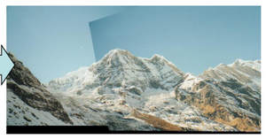

One must fit a model which finds a transformation T between matches, minimising the residual error.
$\sum{\text{residual}(T(x_i), x_i')}$

## Transformations
**Filtering** - Changing pixel values.
**Warping** - Changing pixel locations.
- Euclidean - Translation + rotation
- Similarity - Translation + rotation + scaling
- Affine - Translation + rotation + scaling + shearing
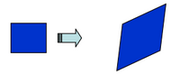
- Projective - Homography
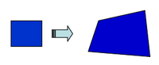

### Linear Transformations
A transformation is **global** if it performs the same action to every pixel.
A transformation is **linear** if it can be represented by a 2x2 transformation matrix, T.
Translation is not linear - everything else is. Their properties are:
- Origin maps to origin
- Lines map to lines
- Parallel lines remain parallel
- Ratios are preserved
- Closed under composition (means there always is a matrix which can compose of multiple transformations)

**Homogenous coordinates** - Add an extra dimension to allow for a linear transformation.
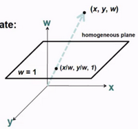
Converting from homogenous coordinates to 2D coordinates:
$\left(
  \begin{array}{c}
    x \\
    y \\
    w
  \end{array}
\right) \mapsto (x/w, y/w)$
Now translation can be represented.
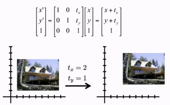

Any transformation which has a "001" at the bottom is an **affine** transformation.
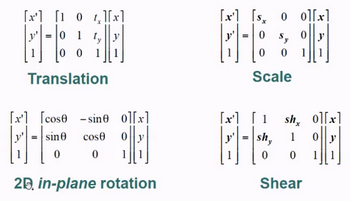
These are basically like linear transformations but the origin no longer maps to the origin.

### Projective Transformations
This is the mapping of one plane to another via a single point.
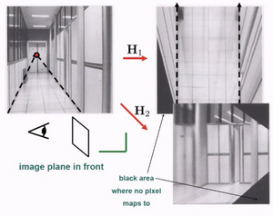
These come about from changing the "001" on the final row, e.g. out-of-plane rotation. Now there are 8 unknown values to find.

Parallel lines may not be parallel anymore, and ratios may not be preserved.
4 pairs of matches are all that are needed to compute the 8 unknown translation matrix values.

### Robustness
Not all matches will be correct. Matches are either right, or very wrong, so using least squares will not cut it when fitting a transformation.
Objective: Maximise **inliers**.
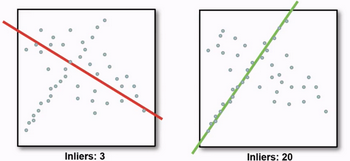
**Random sample consensus (RANSAC)** - Inliers will agree with each other, outliers will disagree with each other. Find the consensus; ignore the outliers.
- Randomly select $s$ sample matches.
- Compute transformation from sample group.
- Find the inliers to the transformation from the total match set.
- If number of inliers is sufficiently large, re-compute least-squares estimate of transformation on all of the inliers.
- Repeat $n$ times, and keep the transformation with the largest number of inliers.
$n$ is a result of the % of outliers and the % confidence we want to guarantee.

### Warping
**Forward warping** - Mapping an image to another by sending each pixel to its transformed location.
Issue: One may encounter holes in the image.
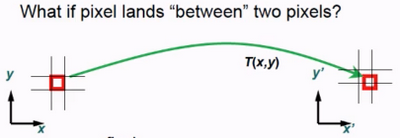

**Inverse warping** - Start from the destination image, and sample the colour value from the interpolated source image.
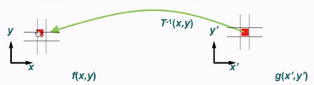

### Panorama Stitching
Now we can easily make panoramas:
- Detect features in all images
- Match features together
- Compute a homography (3x3 transformation matrix) using RANSAC
- Perform some image blending

### Image Blending
**Alpha blending** - Simply cross-dissolve between the two images.
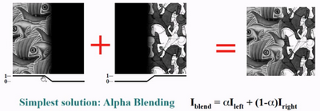
The window size is the area when the images are merged.
Larger than largest prominent feature = ghosting
Smaller than the size of smallest prominent feature * 2 = seams