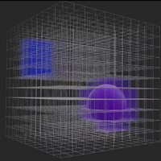
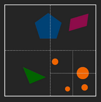
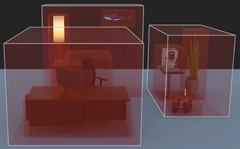
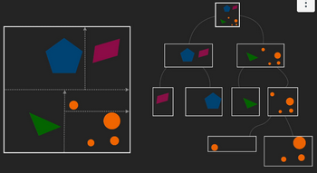
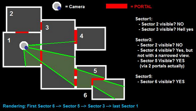

# W10 - Spatial Enumeration
Spacial enumeration techniques are used to organise space so that high-level calculations on them can be done more quickly, such as:
- Whether a point is inside any objects or not
- Whether a ray collides with any objects or not

## Regular Spatial Enumeration
**Gridcell** - A 3D array of voxels, where each point maps to the object it contains.
- Finding what object is at a point is O(n).
- Space complexity is O(n^3).
- Empty space is wasted.

**Octree** - Recursively split a big cube where it matters most.
- Have a threshold for the number of objects allowed in a section.
- Each section contains a list of objects within it.
- Adapts to the objects in space, with less waste on emptiness.
- Time complexity is O(log n)
- Space complexity is O(n)

## Irregular Spatial Enumeration
**Spacial Cohesion** - How objects tend to cluster together in the real world.

**Hierarchical Bounding Volume** - Start with objects, and wrap them in bounding volumes.
- Opposite direction of an octree, going bottom-up.
- Surround clusters of volumes in a grouped volume.

**Binary-Space Partitioning** - Halves the scene until each section is under the object limit.
- Similar to Octree, but more adaptive.
- Can be axis-aligned, like below.

## Culling
There is frustum culling, which doesn't render objects outside our your FOV.
Then there is portal culling, which considers a section of the FOV through doors, windows, etc.
