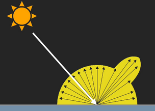
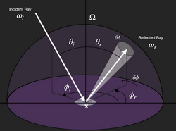

# W6 - Rendering and BRDF
This is the rendering equation:

It is a Fredholm equation of the Second Kind.

## Equation Breakdown
Terms:
- $x$ is a position
- $\omega$ is a direction
- $\lambda$ is a particular wavelength
- $t$ is a particular time
Clauses:
- $L_o$ is the amount of light directed outward (towards the camera)
- $L_e$ is the emitted light, if it is a light source
- The integral is over a hemisphere of inward direction; a bunch of angles
- $f_r$ is the bidirectional reflectance distribution function (BRDF)
- $L_i$ is the light coming inward toward $x$
- $-\omega_i . n$ is the attenuation of inward light due to incident angle

## Light and Materials
Smooth material -> mirrored surface
Rough material -> matte effect, diffuse reflection
Combination -> diffuse and specular reflection

**BRDF** - A function capturing how light interacts with a material, based on the incident and outward angle and the wavelength of the light.
BRDF is a ratio of $\frac{radience}{irradience}$.
Radiance - radiant flux emitted, reflected or received by a surface, per unit solid angle, per unit projected area.

We measure with Altitude angle $\theta$ and Azimuth angle $\phi$ like so:

A BRDF which always returns 0 means that no matter the view angle, or incident light angle, the light level is always 0.

**Subsurface scattering** - When light enters a material and scatters before exiting.

BSDF = BRDF + BTDF + BSSSDF (reflectance + transmission + subsurface calculations)