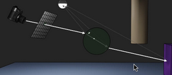
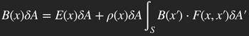
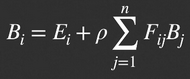
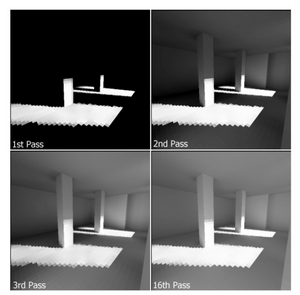
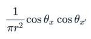
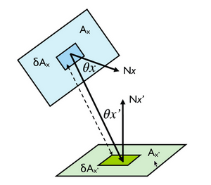
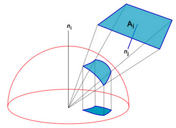
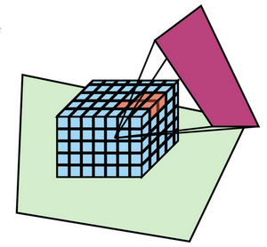

# W7 - Raytracing and Radiosity

## Raytracing
**Ray** - A line with an origin point vector and a direction vector, usually normalised to 1.

**Raycasting** - Firing a single ray into the scene and simulating where it goes.

**Whitted Recursive Algorithm**
1. Cast a ray from the viewpoint through a pixel on the view plane.
2. At intersections, generate a shadow-feeler ray to every light source on the screen.
4. At non-opaque intersectations, apply refraction to bend the ray.
5. Continue until the ray runs out of energy or you're deep enough in the ray tree.
This makes everything hard and shiny, as it ignores the "explosive" diffuse reflection calculations.

- Multiple shadow-feeler rays can be sent to either side of a light source to produce penumbra shading.
- Ray-tracing is highly parallelisable, as each ray is independent.

## Radiosity
- Better suited for diffuse reflection, over specular.
- Patches up a scene in quadrilaterals or triangles.
- Calculates how objects exchange light energy.
- Light sources are polygons emitting their own energy.
- Doesn't care about the viewpoint at all.
- Can't cope with transparent or shiny object.
- Deals with colour blind, softer shadows, etc.
- Best for interactive, real-time renders.
- love
With infinite areas:

Simplified to discrete polygons:

Eflux = emitted light + reflectivity * (influx * form factor for each patch)

1. Identify light source patches
2. Shoot light energy into the scene from the sources
3. Target patches accumulate light energy
4. Repeat the process, starting with patches with the most unshot energy
5. Stop when a threshold percentage of initial energy is used

**Progressive radiosity** - Iteratively transmitting energy to relevant patches.

### Form Factor
The form factor between two patches i, j defines how radiation leaves one patch, j and hits another, i.
It accounts for:
- Patch distance and orientation
- Shape of projected two patches
- Patch obstructions

Distance & orientation are accounted for with:

Where the first part accounts for the inverse square law and the second calculates the orientation with respect to each other.

The projected shape is accounted for with a **Nusselt analogue**:

The form factor is equal to the proportion of the unit circle covered by the projection.

Occlusion is more complex and could be tackled with a **hemicube**:

Each pixel on a hemicube's surface could have its form factor calculated analytically (e.g. ray casting), adding them up for the full form factor of the patch.

### Issues
- Form factors computated for every possible patch pair, O(n^2)
- Patches may not project onto an integer number of pixels
- Flaws in the mesh may provides holes where energy can leak out
- Difficult to decide where to increase patch density initially, could use ray casting to identify interesting areas