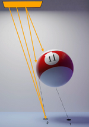
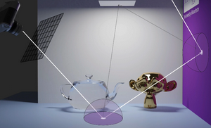
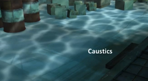

# W8 - Path Tracing
Whitted-style ray-tracing produces crisp shadow edges due to using point light sources.
In reality, shadows have:
**Umbra** - Dark part of the shadow (point 1)
**Penumbra** - Edge of the shadow, lit by some light (point 2)

The realism of the shadow scales with the number of shadow feelers sampling the area light source.

Instead of taking a Whitted-style hierarchical approach, we can trace paths of rays taking uniformly random directions.

From this sampling, we can estimate how light would behave in real life. This allows simulation of diffuse surfaces by shooting many rays through each pixel.

**SPP** - Samples per pixel, usually in the 100s or 1000s to get a noise-free image.

**Texture Baking** - When lighting and objects in the scene are static, you can generate textures for the scene and bake them on, just like with radiosity.

**Ambient Occlusion** - Taking a point and shooting rays from that point, darkening it based on number of blocked rays.

**Caustics** - Reflection of the surface of water or refraction through water, glass, etc.
