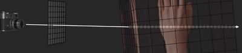
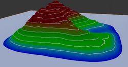
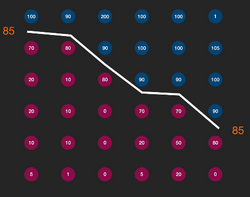
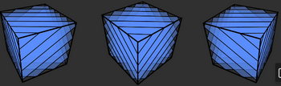
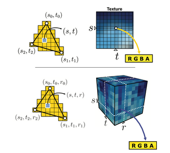

# W9 - Volume Rendering
This is about how to represent the insides of objects.
Usually we have a bunch of scalars representing points in 3D space, e.g. material density from a CAT scan.
**Transfer Function** - Deciding how different values map to opacity / colour in the render.

## Direct Volume Rendering
1. Fire a ray through a pixel of the viewplane.
2. March along the ray in small steps.
3. Record the colour / opacity of each voxel it passes through.
4. Stop the ray when the entire opacity budget is used up or no more objects remain.
5. Accumulate the colour into the pixel.

To help with comprehending renders, faux lighting can be added based on "surface normals," of smoothly varying data.

## Indirect Volume Rendering
The goal here is to turn volume data into polygons. We can do this using iso-surfaces, like iso-lines on a contour map.

We basically have to do this in 3D:

There are inside and outside points, on a cube's vertices instead of a square's.
There are 256 configurations of inside/outside vertices, but only 14 of them are unique due to symmetry.
**Marching Cubes** - The 14 configurations of triangles separating the insides of a cube based on which vertices are "outside".

One a mesh of polygons has been created, you can render in real time again.

**Proxy Geometry** - Drawing cross-sections to represent the volume, usually angled to be normal to the viewpoint.

**Texture Mapping** - Applying textures to a volume.

tm.