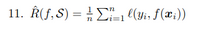

# Practice Questions
## W2
1. Negative-log **likelihood**
2. **False, unfixed variance**
3. **c**
4. **A2, B3, C1, D4**
5. **True**
6. **Because the true distribution cannot be known in most useful cases, meaning we cannot calculate the risk with respect to that distribution.**
7. **True**
8. **False, it is not fixed since the predictor will change based on the data it is supplied with and trained on.**
9. **c**
10. That it is distributed as a **Gaussian** [WITH FIXED VARIANCE]
11. ??? []
12. _The population risk is always non-negative, as it represents the expected negative-log likelihood / loss for the model specified. Loss cannot be negative, as 0 is perfect._ **It is 0 in the case where the model perfectly reflects the true distribution, predicting correctly every time, hence attaining 0 loss every time.** [bernoulli is 0 - 1, ln means its ≤ 0, neg log means ≥ 0]
13. **Because the data it is trained on is a random variable, so it's parameters can change from dataset to dataset.**
14. True, because it affects the model, hence meaning the model may be more representative or less correct for the true distribution. [False?]
15. **Wrong. Distributions can decompose into different forms of loss, and hence risk. One distribution may require a squared loss, whereas another a cross-entropy loss. These are different probems to solve.**

## W3
1. **$\mathbb{E}_{S}$**
2. **Noise**
3. **d**
4. **b**
5. **False**
6. **b**
7. **1.5**
8. **Variance**
9. **True**
10. **True**
11. **d**
12. _2_ [(3-1)^2 = 4]
13. **b**
14. **False**
15. **b**