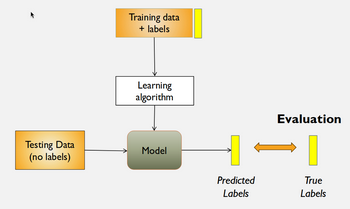
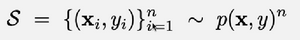
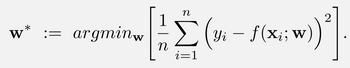
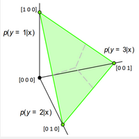
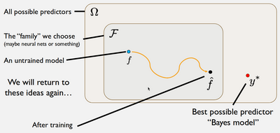

# W1 - Foundations of Supervised Learning
Supervised learning pipeline:

Sample data is **independent and identically distributed** across an unknown probability distribution.
Training dataset $S$:

A model is simply a mathematical function $y = f(x, w)$

A loss function defines how a model misperforms during testing.
Minimising mean squared loss, for regression tasks:

Classification can be performed using probabilities for each class, over a simplex:

This allows us to continue calculating loss normally.
Binary cross-entropy can be used for binary classification problems instead.

The **Hypothesis Space**:

**Bayes model** - The theoretical best possible predictor, minimising population risk.
**Empirical risk, $\hat{R}$** - The average loss over a set of examples.
**Population risk, $R$** - The expected loss with respect to the unknown, true probability distribution. The "true" risk.
**Expected label** - The expected value of a probability distribution.

**Theorem**: The Bayes model under squared loss is equal to the expected label.