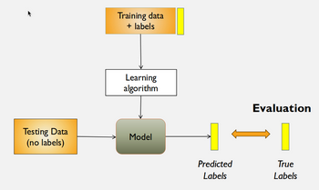
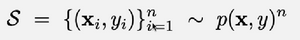
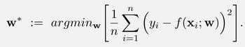
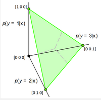
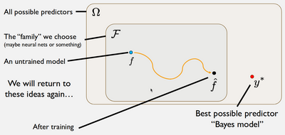
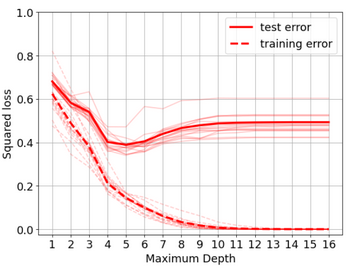

# W1 - Foundations of Supervised Learning
Supervised learning pipeline:

### Data
Sample data is **independent and identically distributed** across an unknown probability distribution.
Training dataset $S$:

### Model
A model is simply a mathematical function $y = f(x, w)$
It may function on something like **logistic regression**, outputting a value between 0 and 1 for any input with a sigmoid.

### Loss
A loss function defines how a model misperforms during testing.
Minimising mean squared loss, for regression tasks:

Classification can be performed using probabilities for each class, over a simplex:

This allows us to continue calculating loss normally.
Binary cross-entropy can be used for binary classification problems instead.

### Algorithm
Learning algorithms are usually iterative, taking a model from point A to point B in the **Hypothesis Space**:

<<<<<<< Updated upstream
**Bayes model, $y^*$** - The theoretical best possible predictor, minimising population risk.
**Empirical risk, $\hat{R}$** - The average loss over a set of examples.
**Population risk, $R$** - The expected loss with respect to the unknown, true probability distribution. The "true" risk.
**Expected label** - The expected value of a probability distribution.

**Theorem**: The Bayes model under squared loss is equal to the expected label.
=======

### Underfitting & Overfitting
We already know about this. Test / training loss will typically follow this shape when starting to overfit:

### Risk
**Empirical risk, $\hat{R}$** - The average loss over a set of examples.
**Population risk, $R$** - The expected loss with respect to the unknown, true probability distribution. The "true" risk.
**Generalisation gap** - The difference between the two. $\hat{R} - R$

**Bayes model** - The theoretical best possible predictor, minimising population risk.
**Expected label** - The Bayes model under squared loss.
**Bayes risk** - Simply the risk value of the Bayes model.
>>>>>>> Stashed changes
