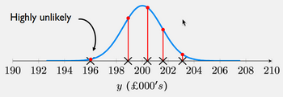
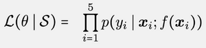
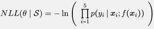
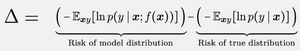
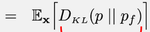

# W2 - Probability for Learning
**Bernoulli distribution** - A binary distribution with one input, $\mu$, the probability of one output.
**Gaussian distribution** - A normal distribution with two inputs, $\mu, \sigma$, the mean and std.

With noise distributions in real life, we can fit a Gaussian to them by maximising likelihood.

A likelihood may be bigger than 1. They are not probabilities.
Objective: find $\mu$ and  $\sigma$ should that the likelihood product of sample values is maximal.

This causes likelihoods to be extremely small, with potential underflow. Can instead minimise **negative log likelihood**:

This simplifies to the squared loss equation; a consequence of assuming Gaussian noise.
The model can be trained by minimising the empirical average of the loss, and predict the mean.
Similarly, cross-entropy loss comes from taking negative log likelihood of a Bernoulli.

**Split-Gaussian** - Different std for left / right of the mode, $m$.

**Excess risk** - The difference between the model distribution risk and the true distribution risk.

This is the **Kullback-Leibler divergence**.
