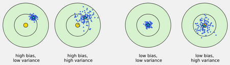
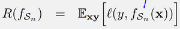
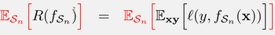
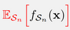
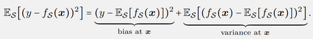
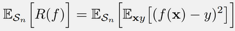
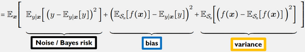
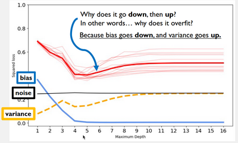
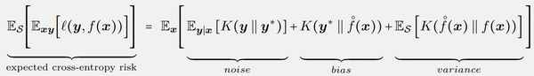

# W3 - The Problem with Learning
Sample data is random, causing all other quantities stemming from it to be random variables with distributions.
If our sample data is not representative of the population, not i.i.d., there is a major risk of overfit.

Risk can be traced to either:
**Random variance** - Caused by random nature of sampling, or overfitting.
**Systematic bias** - Caused by learning algorithm, bias in sampling, underfitting, etc.

We know the population risk is the unknown average loss:

where $f_{S_n}$ is a model trained on a training set.
**Expected risk** - The average population risk over all possible training sets.

**Expected model** - The prediction obtained by the average of models trained on all possible training sets.

This is what allows us to assess our learning algorithm.

Expected squared loss contains terms for bias and variance:

This is NOT risk. This is the expected loss with respect to changing the model's training set.

And the expected risk for squared loss:

The squared loss of the model, averaged over the true data distribution (risk), averaged over all models trained on the training sets.

This decomposes into terms for noise, bias and variance. Other types of losses decompose into different terms.

When we overfit, the bias decreases, and the variance increases. The goal is to minimise risk from bias and variance.

Noise is the variance in the labels. It is the "base" variance.

In summary, extremely complex models can have high variance in their results when changing out their training sets.
Models which are too basic will have high bias as they are not utilising the input enough regardless of the training set.

Bias-variance decomposition does not hold for every kind of loss, e.g. zero-one loss where you predict yes or no for one value.

For expected risk of cross-entropy loss, written in KL divergences:
