# W4 - Combining Multiple Models
Complexity is not just about the number of parameters within a model.
Committee of models shouldn't be identical, or non-sensically different.

## Bootstrap Aggregation
**Bootstrapping** - Given a set $S$ of samples, a new set $S'$ is created, sampled uniformly from the original set $S$.
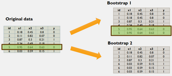

**Bagging** - Bootstrap aggregating, where each bootstrapped sample will be used in a new model.
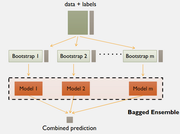

Probability of any one example being included in a bootstrap is ~63%, but this is OK with more bootstraps and models.
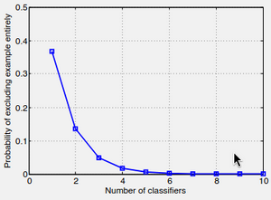
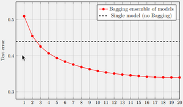

### Ambiguity Decomposition
**Ensemble combiner** - How to use the results of many different models as one.
When defining the ensemble combiner as taking the mean of the models, the **ensemble loss** breaks down:
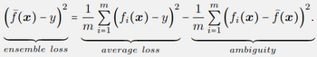
The loss of the ensemble is less than the mean loss of its parts, precisely by the ambiguity.
**Ambguity** - The mean loss between a model prediction and ensemble prediction. This gives us the reduction in loss.

For cross-entropy, and combining the models as a geometric mean, instead of squared loss and arithmetic mean:
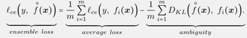

The ensemble population risk is always better than the average of the models' population risk.
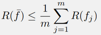

### Linking Back To Variance
The ensemble approach attempts to reduce variance by averaging models over training sets.

If a set of random variables $f_1(x),...,f_m(x)$ are uncorrelated:
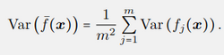
The variance of the average variable is less than the average variance of the random variables.
This maps 1-1 onto onto model variance.

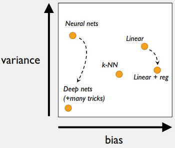

For an ensemble of models, we have to consider **diversity** in a three-way tradeoff.
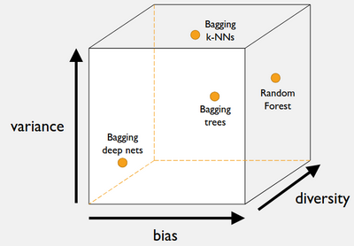

So for an ensemble of models, the expected risk is:
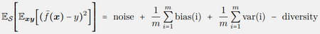
Where:
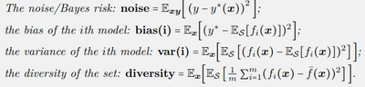
Bias is the average bias of each model.
Variance is the average variance of each model.
Diversity is the expected ambiguity term.

Using zero-one loss, we can do binomial stuff to find committee error with majority voting:
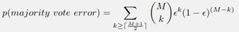
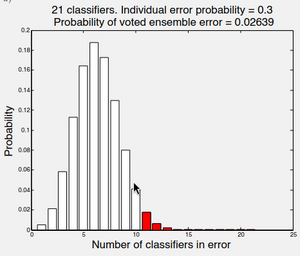
By increasing the number of models, a 30% error rate can reduce to a 2% error rate in this case.