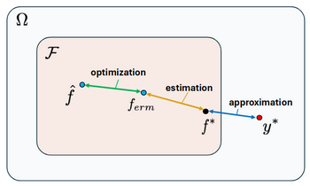
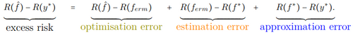
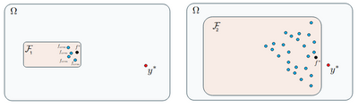
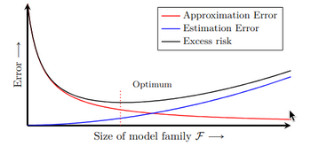
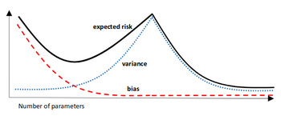
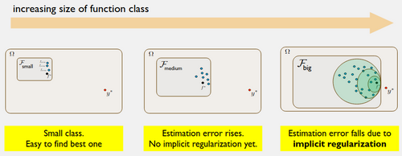

# W5 - Sources of Risk
## Causes of Risk
Overall risk is composed of:
- Algorithm / compute limitations
- Data limitations
- Model limitations

**Empirical risk minimiser ($f_{erm}$)** - Given a function class, and dataset, this model minimises the empirical risk.

**Best-in-family model ($f^*$)** - The best model within the chosen function class, found with infinite data and a perfect learning algorithm.

**Bayes model ($y^*$)** - The model we would achieve with infinite data, a perfect learning process, and infinite model capacity.

The risk improvements that each of these models compose the **excess risk**.

**Optimisation error** - There is a computational or algorithmic limitation, preventing us from getting the perfect model(s) given our data.

**Estimation error** - There is a sample limitation, preventing us from minimising population risk within our model family.

**Approximation error** - There is a structural limitation, as we are confined to a function class which the Bayes model may not be in.

## Expanding the Function Class
By expanding the function class, we give space for the model to become more complex (and potentially overfit).
The approximation error can only ever decrease as the class expands (including previous models), as the best-in-family model can only get better.

However, estimation error will become more delicate, generally increasing, with the more ERMs there are capturing noise.

Variance ties in with optimisation and part of estimation, bias ties in with approximation and part of estimation too.

## Double Descent
**Over-parameterisation** - There are more model parameters than training examples.
When a model is over-parameterised, its risk can undergo **double descent**.

**Implicit regularisation** - In over-parameterised scenarios, stochastic gradient descent prefers smaller weights, meaning some ERMs are preferred over others.
