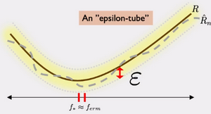
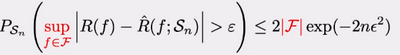
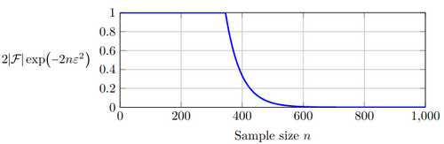
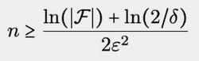
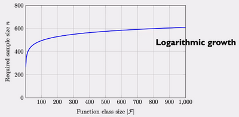
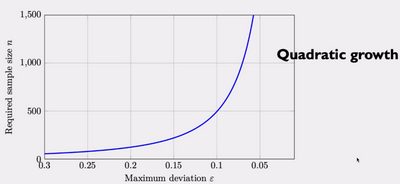
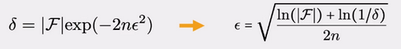
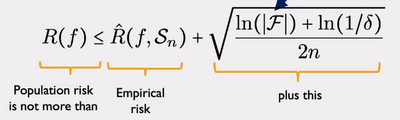

# W6 - Being Probably, Approximately Correct
The optimal empirical risk $f_{erm}$ may differ from the optimal population risk $f_*$, varying the model type.
The difference between these is the estimation error. 

We want to reduce the estimation error arising from the data, by minimising this probability:

We need to figure out how much data is needed to satisfy this condition.

**Hoeffding's inequality** defines what $\delta$ should be based on the value of $\epsilon$.

The upper bound gets exponentially smaller as the amount of data increases.

This can be perfectly mapped onto learning, by looking at a model trained on datasets of size $n$ instead of $n$ samples of individual data points.

start of file is on pc - amended

**Uniform deviation bound** - Setting $\epsilon$ forms an epsilon-tube around the population risk.

Having $\hat{R}$ within this tube is what we want.

However we aren't just varying the data in training, we are searching over the function class.
Applying the bound for all functions in the class, not just one:

$sup$ is which function does the worst case scenario, i.e. the maximum of $|R-\hat{R}|$ across all functions in the class.
$|\mathcal{F}|$ is the size of our function class.

This can be rearranged for n, to be less than $\delta$:

Meaning we can choose how close we want to be to population risk, how big our function class is, and the probability of the bad event to obtain a minimum sample count.

As the model class size increases, the data requirement does not increase nearly as much.

As the deviation allowed decreases, the sample requirement is inversely quadratic and explodes upwards.

Its only really an issue when our empirical risk predicts a lower risk than the population risk.
By taking only one of the two tails:

Now we can bound the population risk with regards to the empirical risk:

