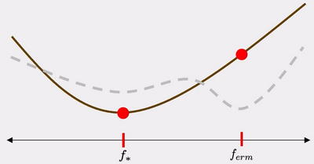
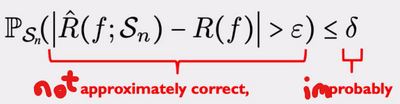
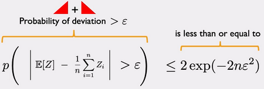
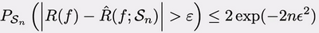

# W6 - Being Probably, Approximately Correct
The optimal empirical risk $f_{erm}$ may differ from the optimal population risk $f_*$, varying the model type.
The difference between these is the estimation error. 

We want to reduce the estimation error arising from the data, by minimising this probability:

We need to figure out how much data is needed to satisfy this condition.

**Hoeffding's inequality** defines what $\delta$ should be based on the value of $\epsilon$.

The upper bound gets exponentially smaller as the amount of data increases.

This can be perfectly mapped onto learning, by looking at a model trained on datasets of size $n$ instead of $n$ samples of individual data points.

