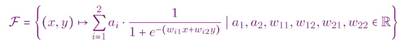
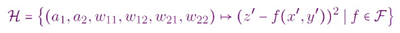
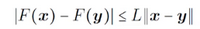
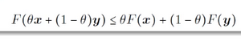
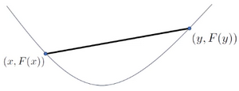
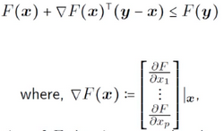
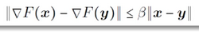
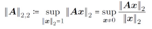
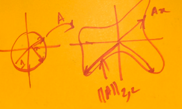

# W7 - Background Mathematics
## Function Classes
Some notation:
- $\mapsto$ means maps to
- | means for every
- $\forall$ means for all
- $\epsilon$ means in

A NN architecture with unassigned weights is a function class. Any architecture is a class.

Models are functions of input data, parameterised by weights.

Losses are functions of the weights.

### Euclidean Norm
**2-Norm** - Given a vector, its 2-norm is the euclidean distance from the origin.
$||v||_2 = \sqrt{v^2_1+v^2_2+...+v^2_p}$
Basically, how long a vector is.

### Lipschitzness
**L-Lipschitz** - A function F, $\mathbb{R}^p \rightarrow \mathbb{R}$, where for any two sets of inputs $x, y$:

This means a function is linearly upper-bounded. The gap between the outputs is always less than the gap between the inputs (multiplied by L).
Basically, its gradient is always less than L.

$F(x) = x$ is 1-Lipschitz.
$F(x) = x$ is not Lipschitz.

### Convexity
**Convexity** - If a function's graph between any two points always lies below or on some chord joining the points $(x, F(x)),(y, F(y))$.

Which basically says this:

A differentiable function is convex if:

Basically its differential at prior point x is lower than at point y. Its curvature is $\ge 0$.

**Differentiable** - When a function does not have any hard edges, and its differential will output real numbers.

### Smoothness
**$\beta$-Lipschitz smoothness** - When a differentiable function satisfies:

So basically its differential is L-Lipschitz.
$F(x) = x^2$ is 2-smooth.

### Convergence
A sequence of points converges at a point if as the limit reaches infinity, the 2-norm between the last point and the convergent point is 0.

### Supremums and Infimums
A supremum is the least upper bound given some bounds.
An infimum is the greatest lower bound given some bounds.
$I = [0, 1) \rightarrow \text{sup } I = 1$
Basically, this number is greater than all numbers within that bound (if a supremum).

### Spectral Norms
A matrix's **2, 2-norm** is defined by:

Basically, it takes all vectors $x$ of length 1, takes the largest vector of applying the matrix $A$ to $x$.
It is the maximum factor by which $A$ stretches a vector, $x$.

### Matrix Rank
Unit vector examples:
$e_1 = [1,0]$
$e_2 = [0,1]$
The **image** of a matrix $A$ is defined as $A[v]$, where $v$ is a random vector. ($m \times n$ and $n$ for vec)
The **rank** of a matrix $A$ is the number of orthogonal vectors required to represent the matrix image.
E.g. $\text{dim}(2e_1+e_2)=2, \text{dim}(-e_1)=1$

A **full rank** matrix is where its rank is equal to its smallest dimension. $\text{rank}(A)=\text{min}(m,n)$
