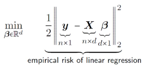
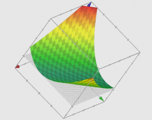
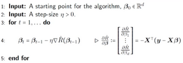
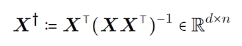
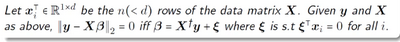

# W9 - GD in Overparameterised Linear Regression

## Linear regression
Given $n$ data points in $d$ dimensions, as a $n \times d$ matrix $X$:
Let the labels for each data point be given as a vector $y$, of size $n$.

So you take half of the 2-norm square of the difference between each label and what the weight vector $\beta$ predicts. This is squared loss.

A plot of the empirical risk of over-parameterised linear regression in 2-variables with one data point, $y=4, X=[1,2]$.

Linear regression has this infinite tube-like loss shape. Along the dark-green is uncountably infinite global minima at the bottom of the tube.

### What about GD?
Which minimum will GD find? Generally, the closest one, but its hard to prove.

Gradient descent in linear regression:

The left formulation says that differentiating empirical risk with respect to the weights is the same as computing the loss.

### Assumptions
- Assume the model is overparameterised (\#data < \#training params)
- $X$ is a full rank matrix.
$\text{Rank}(X) == n < d$
It should be easy to satisfy this, as with such a high dimension, there is plenty of orthogonal space. Its assuming that the data matrix consists of linearly independent data.
Each row of a matrix essentially scales a vector its multiplied with in a certain.

A full-rank data assumption helps analysis, because it means $X X^T$ is must be **invertible**, only occuring in this case.
**Invertible** means another matrix exists, $X^{-1}$ where $X \cdot X^{-1} = I$.
Invertible matrices do not send non-zero-vectors to zero-vectors. Its like how the only non-invertible number is 0, because it makes non-zero numbers zero numbers.

Rank deficient (non-full-rank) matrices are never invertible. Information is lost.

### Global Minima
At $\beta = X^T(X \cdot X^T)^{-1}y$, the linear regression loss function is at its global minima, i.e. 0.
$\hat{R}=||y-X\beta||^2_2 = 0$

We denote:

Where X-dagger is the pseudo-inverse of X. It works on non-square matrices where a true inverse does not exist. It's a one-sided identity.
$X X^{\dagger} = I$

But $X^{\dagger} y$ is not the only minima.

