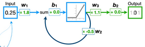
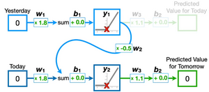
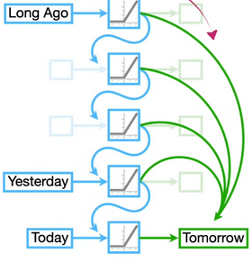
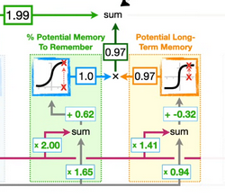
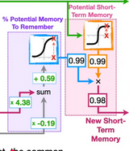

# Machine Learning Basics
Neural networks can make predictions on a set amount of input values, unchanging.

## Recurrent Neural Networks
**RNNs** have feedback loops, meaning they can make predictions on variable amounts of input values.

This is useful for sequential data.
The summation in the middle allows all values to influence the output.
RNNs can be unravelled based on how many inputs there are.

### Vanishing / Exploding Gradient Problem
The more we unravel an RNN, the harder it is to train.
This is because the $w_2$ weight's effect exponentially influences the final output as the input gets longer.
The gradient either gets so big that it keeps missing the optimum, or so small that it never reaches the optimum.

## Long Short-Term Memory
LSTMs uses 2 paths in the network, one for long-term memories and one for short term.

The **Forget Gate** determines what percentage of the long-term memory will the remembered using the Sigmoid activation function.
The **Input Gate** processes an input to update the long-term memory using Sigmoid for % rememberance and Tanh for the value. This is added to the previous LTM.

The **Output Gate** updates the short-term memory using the same process as the input gate. This overwrites the previous short-term memory fully.
