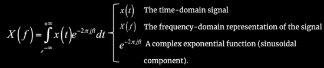
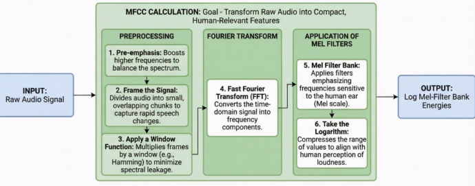

# W10 - Speech Recognition and Synthesis
Speech is composed of multiple overlapping frequencies:
- Pitch (fundamental frequency)
- Formants (resonant frequencies of the vocal tract)
- Harmonics (multiples of the fundamental frequency)

### Fourier Transforms
A **Fourier Transform** does two main things:
- Breaks a signal into its frequencies
- Provides amplitude and phase for each frequency

It compares the signal to a set of pure sine waves.

## Mel-Frequency Cepstral Coefficients
- Feature extraction technique used in speech processing
- Represents the short-term power spection of sound using the Mel scale
- Mel scale is based on human perception of sound frequency
- Focuses on the most relevant frequency ranges

### Calculating MFCC
0. Input the signal in the time domain
1. Balance audio spectrum
  Boost higher frequencies to compensate for natural energy loss in speech.
2. Capture rapid speech changes in frames
  Around 20-40ms, assume signal is stationary within frames.
3. Smoothen frames with a hamming window
  This is to prepare the signal for an FFT, avoiding spectral leakage.
4. Convert to frequency spectrum using an FFT
5. Mimic frequencies attuned to human hearing
  Convert Hz to Mel scale, which is linear for low frequencies and logarithmic for high ones.
6. Take the logarithm ?? Idk bruh

## Speech Recognition
Automatic speech recognition is to transform acoustic information from speech waveforms into linguistic structures.

1. Extract spectral features like energy and frequency information, e.g. using MFCC.
2. 