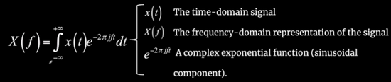
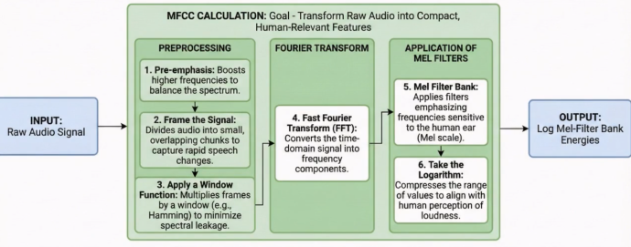
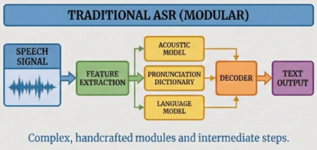
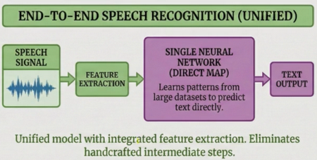

# W10 - Speech Recognition and Synthesis
Speech is composed of multiple overlapping frequencies:
- Pitch (fundamental frequency)
- Formants (resonant frequencies of the vocal tract)
- Harmonics (multiples of the fundamental frequency)

### Fourier Transforms
A **Fourier Transform** does two main things:
- Breaks a signal into its frequencies
- Provides amplitude and phase for each frequency

It compares the signal to a set of pure sine waves.

## Mel-Frequency Cepstral Coefficients
- Feature extraction technique used in speech processing
- Represents the short-term power spection of sound using the Mel scale
- Mel scale is based on human perception of sound frequency
- Focuses on the most relevant frequency ranges

### Calculating MFCC
0. Input the signal in the time domain
1. Balance audio spectrum
  Boost higher frequencies to compensate for natural energy loss in speech.
2. Capture rapid speech changes in frames
  Around 20-40ms, assume signal is stationary within frames.
3. Smoothen frames with a hamming window
  This is to prepare the signal for an FFT, avoiding spectral leakage.
4. Convert to frequency spectrum using an FFT
5. Mimic frequencies attuned to human hearing
  Convert Hz to Mel scale, which is linear for low frequencies and logarithmic for high ones.
6. Take the logarithm ?? Idk bruh

## Automatic Speech Recognition
Automatic speech recognition is to transform acoustic information from speech waveforms into linguistic structures.

1. Extract spectral features like energy and frequency information, e.g. using MFCC.
2. Use acoustic models to detect phonemes from audio signals.
	- Hidden Markov model with Gaussian mixture model dominated historically
    - NNs have been shown to outperform GMMs recently
3. Define phoneme combinations for words with a pronunciation dictionary.
4. Predict word sequences based on context with a language model outputting sentence probabilities.

## End-to-End Speech Recognition
This process can be done entirely in a nearal network, directly mapping audio features to text.

This has a simpler architecture, unified learning and improved performance.
The NN output can be connected to a language model to correct misheard words.

## Speech Synthesis
1. Preprocess the text by normalising words (Dr. -> doctor), handling abbreviations (e.g. -> for example), and numbers.
2. Extract linguistic features, punctuation, structure using POS tagging and syntactic structure analysis.
3. Complete phonetic analysis to output a sequences of phonemes. If word in dictionary, perform a lookup, else do grapheme-to-phoneme conversion.
4. Prosody modelling to control pitch, stress, duration and intonation of each phoneme, using linguistic rules and ML models.
5. Generate a waveform with the processed information with concatenative / formant / neural synthesis.

This classical pipeline can also be replaced with an end-to-end model, or certain steps in the pipeline can be replaced.