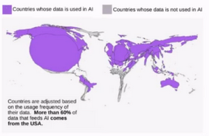

# W11 - Ethical and Social Issues in NLP
There are loads of pre-trained LLMs around these days. They can be used to:
- Manage communications
- Decision support
- Training and education
- Coding

### What do LLMs learn?
**Formal language competence** - Knowledge of linguistic rules and patterns, and being able to adhere to them
**Functional language competence** - Understanding and using language in the real world
"The chicken does not fit into the cage because it's too small" -> LLMs struggle with understanding this.

### Hallucinations
- LLMs can generate statements which are unsupported by data
- Poses significant risk to sensitive fields e.g. healthcare
- Can hallucinate number based questions easily
- Just looking for words to fit nicely together
- Need to learn to say "I don't know?"

### Retrieval Augmented Generation
- Combine an information retrieval component with a text generator model
- Relevant documents used as a context for the prompt
- Mitigates hallucination without need to update the model

### Testing and Validation
- Number of available models is exploding
- Testing is mostly ad-hoc
- Can the model do harm?

### Data Collection
- May not be representative, with cultural bias
- May not be appropriate for the task
- May have bias in the human labelling
- Copyright issues
- Sensitive data may be used
- Can amplify unwanted societal biases
- Synthetic, AI-made data could pollute training
- LLM providers are not transparent about this

## AI Impact
### Jobs
- Proportion of tasks completed by humans vs machines constantly rising
- Jobs in computer science shifting towards AI specialism and data analysis
- Cashiers, administrative, customer service jobs rapidly declining

### Environment
- Carbon footprint of training a single LLM is around 300,000kg of CO2
- Global AI water demand could be equivalent to half of the UK's withdrawal in 2027
- Massive energy consumption during training

### Geopolitical Impact
- An AI "arms race" has been happening
- Furthers world economic divide with rich countries funding the most development
- Petitions to slow down the biggest developers of AI to allow catch-up
- Decisions should not be delegated to unelected, powerful tech leaders
- 22 min in