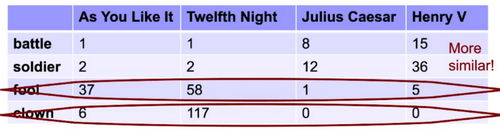
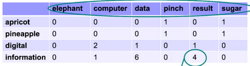
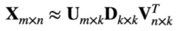
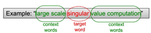
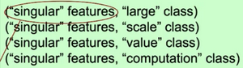
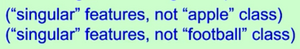

# W4 - Distributional Semantics
**Distributional semantics** is about characterising the meaning of a linguistic item, through a multi-dimensional feature vector.
**Feature vector** is just a set of numbers describing an item.
**Semantic similarity** can be quantified between two vectors using cosine or inner product.
**Distributional hypothesis** is that one can infer the meaning of a word just by looking around it.

### Vector Space Model (Simplest)
Make your word vectors by document.
This is a naive approach, as two words may appear in the same document but not be similar.

Or you can make your word vectors by local context, with a context window.
You would have to make a vocabulary to consider words against.
Smaller window = syntax, larger window = semantics.

VSMs generate high-dimensional, sparse vectors, where most elements are zero.

### Latent Semantic Indexing (Historic)
The method is just the singular value decomposition (SVD).
It doesn't matter. It's archaic.
LSI can do document and term vectors, like a VSM.
You can do truncated SVD by choosing a k value smaller than the rank of the input matrix.

### Word2vec and GloVe (Classical)
These can produce low-dimensional, dense vectors.
One must define the context, and then pick a prediction task:
- Whether a word appears in the context of a target word (word2vec)
- How many times a word appears in the context of a target word (GloVe)

### W2V: Continuous Bag-of-Words Model
- Look at each word and find its context on either side
- Attempt to classify the word in the middle e.g. [large, scale, value, computation] class: [singular]

- Each context word corresponds to a vector of weights for every word
- Take average of context vectors forming a feature vector
- Select one of the word classes using logistic regression

### W2V: Skip-Gram Model
- Predict context from target instead
- Multilabel classification (one object can have multiple classes)

- Can be improved through negative sampling

### GloVe Model
- Utilises the frequency that a word appears in another word's context
- Word-word co-occurence matrix from entire corpus
- King - man + woman = queen