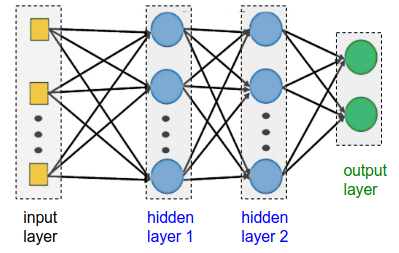
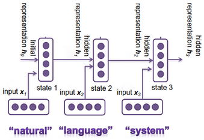
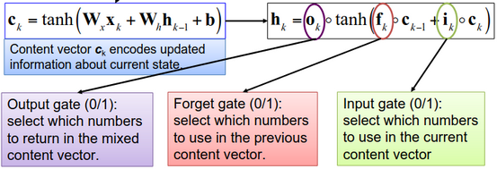
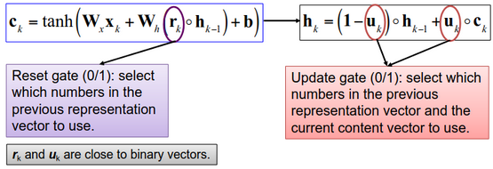

# W5 - Deep Learning For NLP

## Deep Learning
DL emphasises networks with higher numbers of layers compared to NN.
DL refers to building end-to-end NN systems.
DL tasks in NLP:
- Sequence distribution
- Sequence classification
- Sequence labelling
- Seq2seq learning

## Basic NN Architectures
Activation functions:

**Single neuron** - Multiple inputs in a layer and one output y.
**Single layer perceptron** - One input layer and one output layer.
**Multilayer perceptron** - One input layer, multiple hidden layers and one output layer.

## RNN Architectures
RNNs are used to capture data patterns and encode information in sequential data.

**Vanilla RNN** - Uses standard neuron operation to compute the hidden representation vector.

This can result in **vanishing gradient** issues with the training process, causing **dependency loss** between the current and long-distance past states.

This can be modified to fix the vanishing gradient issue.
Long short-term memory:

Gated recurrent units:

## Advanced RNN Architectures
**Bi-directional RNN** - Consider both left and right context. "The movie is _terribly_ exciting."
Concatenate hidden representations computed by two RNNs using the original and reversed sequences as input.

**Multilayer RNN** - Stack multiple layers of RNNs. The output of one hidden layer is used as the input for the next hidden layer.