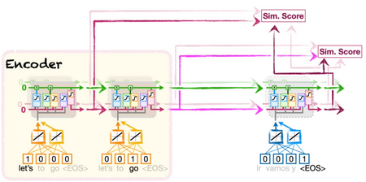
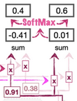
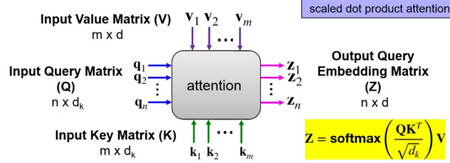
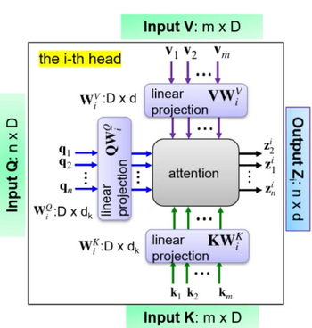
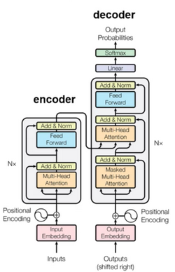
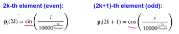

# W7 - Deep Learning For NLP 2

## Attention RNNs
- Unrolling LSTMs compresses an entire input sentence into a single context vector (**information bottleneck**)
- A word at the start of a sentence can get lost in translation
- Attention solves this problem, where encoder info is accumulated at the start of the decoder
- Automatically search for relevant parts of a source sequence for the target term
- Builds direct connections between each state in the decoder to each of the encoder states
- Makes similarity scores between LSTM outputs from each step of the decoder and encoder (cosine similarity)

- Cosine similarity can be put through a softmax function to determine what percentage of each input to use for an ouput word
- A softmax can input any amount of numbers and output probabilities adding up to 100%

### Benefits
- Improves model performance
- Mitigates information bottleneck
- Mitigates vanishing gradient problem
- Provides interpretability

### Multi-head Attention
- Introduces linear projection to process the input
- Repeat with a different set of projection matrices each time
- Can focus on multiple types of relationships between encoder and decoder steps at a time
- Useful for complex sentences

## Transformers
If attention allows us to make links between the encoder and decoder automatically, can't we drop the recurrent part?
This is a transformer, proposed in 2017. Its building blocks are:
- Multi-head attentions
- Fully-connected feedforward NNs
- Add & Norm operation
- Positional encoding
So many of a transformer steps are parallelisable for each token.

### Positional Encoding
- Inject order information into the model input
- Equal dimensionality to input vector
- This is how the PE vector is generated:

### Add & Normalisation
- Prevents information loss/change caused by a layer
- Add the input and output of previous layers together
- Normalise the sum by re-centering and rescaling

### Transformer Attention
- **Self-attention** calculates the similarity between words even within the input
- "The **pizza** came out of the oven and **it** was good" - attention links up pizza and it
- **Query values** are generated for each word to represent them
- **Key values** are also generated which can be compared to other words' query values
- The same weights are used for all queries, and another set for keys, and another for values
- Similarity scores are put through a softmax to determine percentages of what values to use
- **Values** of the words are scaled by this similarity scores
- This establishes how each input word interacts with others
- The key-query stuff is also done for **encoder-decoder attention**

### Fully-Connected Layer
- Simple NN with weights
- One output for each token in the output vocabulary
- Outputs are put through another softmax to output probabilities