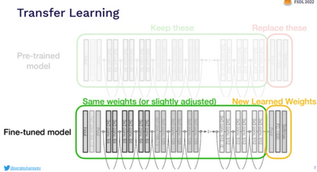
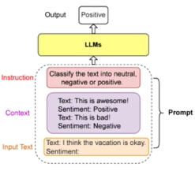
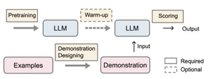

# W9.1 - Using LLMs

**Foundation models** - Models that are capable of a range of general tasks
- Built on enormous, general data
- Can be built on top of to develop specialised applications

### Fine Tuning
- Use representations learnt by Pretrained Language Models by **adaptation** or **transfer learning**
- Can be hard to tune parameters since PLMs are larger and larger
**Transfer learning** is where a model trained on one task is reused as the starting point for a different but related task

### Knowledge Destillation
Large models are computationally demanding, so a smaller model (student model) can be trained to retain comparable knowledge of a larger model.
DistilBERT reduces a BERT by 40% while keeping 97% of NLU and being 60% faster.

## Prompting
Prompts include instructions, and optionally context and input text, to the model to direct its answer.

**Prompt engineering** - Developing and optimising prompts to efficiently use LLMs.
**Prompt design** - How to present task instructions and expressions to use.
**Self-prompting** - Getting the AI to refine a prompt.
PLMs are very sensitive to prompts and can return sub-optimal results for more human-reasonable input.

### In-Context Learning
**In-context learning** - PLM performs a task just by conditioning on input-output examples.
**Scoring** - Using a function to transform predictions of the PLM to an estimation of the likelihood of an answer.
**Warming up** - Fine-tune the model on a dataset covering a broad range of tasks.

**Zero-shot** - Provide no example questions with answers.
**Few-shot** - Provide a couple of examples before posing a question. (May be biased)
**Chain-of-thought** - Provide examples with "reasoning" and asking it to provide reasoning.

Prompting should use roles, domain-specific instructions and specific directives.

**Instruction tuning** - Providing prompts and labelling / ranking answers for supervised learning (reinforcement learning from human feedback).
**Safety tuning** - Optimised for conversations and adding guardrails for generated content.