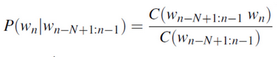
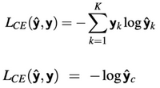

# W2 - Word Rep and Language Models
## Word Representations
Sparse vectors:
- TF-IDF, where you track how often a term appears in a document relatively
- PPMI, where each dimension in the vector corresponds to another context word
- Many dimensions, 10000s, with most values being 0

Dense vectors:
- word2vec, predicting context given the target word, or other way around
- GloVe, using a word co-occurrence matrix for prediction
- fastText, use subwords to handle OOV words
- Fewer vectors, 100s, far fewer weights to learn

## Language Models
### N-gram Models
- Track how often certain unigrams, bigrams, trigrams, etc. appear
- Pick the highest probability results based on this history
**Markov assumption** - The probability of a word in a text is about the probabilty of appearing in limited history

n-gram approximation using the conditional probability of the next word:

$P(\text{ham} | \text{and}) = C(\text{and ham}) / C(\text{and})$

### RNN Models
Use feedback loops to predict words based on the previous words for sentences of any length.
Can use cross-entropy loss, where it is simply the negative logarithm of the correct word probability.
