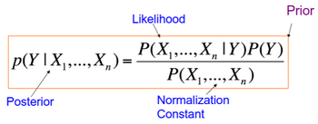
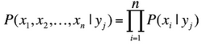
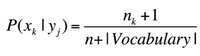

# W4 - Text Classification
**Naive Bayes** - Assuming data is independent, and modelling based on conditional probabilities of data and their labels.
There are two event models:
- Multi-variate Bernoulli model, a document is a binary vector over word space.
- Multinomial model, capturing word frequency in documents.

**Bayes Rule**:

To find the most likely label $y$ given a set of words $X$, one can just maximise the likelihood * prior with respect to labels $Y$.

Instead of explicitly modelling the likelihood, we can assume all features are independent:

This is what Naive Bayes classifiers do.

We can do **add-one smoothing** to avoid zero probabilities.

Pretraining vs Fine-tuning
- Billions of tokens -> thousands of labelled examples
- Unlabelled text -> labelled text
- High compute -> lower compute
- Learning language -> learning task behaviour
