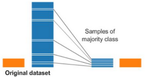
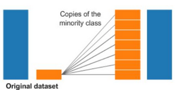
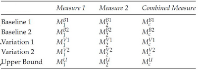
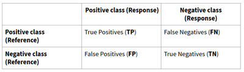
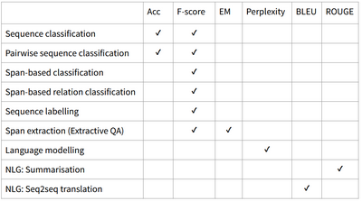

# W5 - Evaluation
## Evaluation Types and Data Preparation
**Evaluation** - Assessing to the extent which a system produces expected outputs.

### Automatic vs Manual
**Manual evaluation** involves humans to assess output.
**Automatic evaluation** is data-driven and requires algorithms mimicking humans.

### Formative vs Summative
**Formative evaluation** occurs during development, informing the developer of their progress. Usually automatic and lightweight.
**Summative evaluation** occurs after system completion, to assess if goals were achieved. Usually human.

### Instrinsic vs Extrinsic
**Intrinsic evaluation** assesses the system's performance on the internal task.
**Extrinsic evaluation** assesses the impact the system has to the problem it solves.

### Component vs End-to-End
**Component evaluation** assesses each component of a pipeline, isolating errors and finding specific problems.
**End-to-end evaluation** assesses all components for effectiveness in real-world conditions.

### Data Preparation
Training, dev/validation, test datasets. We know this.

**Fixed partition** - Simply partitioning the data as train, dev, test sets. Usually 70/20/10 split.
**k-fold cross-validation** - Data split into 4-10, k, folds. For each i in 0 to k, use fold i as the test set and every other fold as the training set.

**Stratified random sampling** - Ensuring each affective class is sufficiently represented in the test set.

### Dealing with Data Imbalance
**Random under-sampling** - Take a sample of the majority class to make the classes equal. Loss of data.

**Under-sampling with Tomek links** - Removes pairs of instances from opposite classes which are very similar (Tomek links).

**Random over-sampling** - Copies randomly selected instances from minority class. Greater overfitting potential.

**Synthetic minority over-sampling technique** - Creates new instances from the minority class by randomly selecting an instance m, finding the k nearest neighbours, picking one of them n, and taking the convex combination of m and n.

## Reliability of Data
Humans may differ when annotating data.
**Intra-annotator agreement** - Whether the same human consistently annotates the same item.
**Inter-annotator agreement** - Whether multiple humans consistently annotate the same item independently.
This indicates how well-defined an annotation task is, and an upper-bound for automated methods.

### Agreement Coefficients
**Observed agreement, P(a)** - Proportion of times annotators agree to total annotations.
**Expected agreement, P(e)** - Proportion of times annotators are expected to agree by chance.
**Cohen's Kappa coefficient** - $K = \frac{P(a)-P(e)}{1-P(e)}$
Negative means disagreement, zero means no agreement, positive means agreement.

There is also Scott's Pi, Fleiss' Kappa, etc.
For non-binary problems of classification like NER, F-score between the two annotators is used instead.

### Significance
General structure for reporting evaluations goes like so:

One must check for statistical significance in improvement over baselines. A null hypothesis statistical test can be carried out on the data.

Normal distribution + unpaired data - Independent t-test
Normal distribution + paired data - Paired t-test
Non-normal distribution + unpaired data - Mann-Whitney U test
Non-normal distribution + paired data - Wilcoxon signed-ranked test

## Evaluation Metrics
**Gold standard** - The reference / source of truth / what is correct.
**Response** - The system output / predictions made.

**Accuracy** - $\frac{TP+TN}{TP+FN+FP+TN}$, i.e. number correct over total.
**Precision** - $\frac{TP}{TP+FP}$
**Recall** - $\frac{TP}{TP+FN}$
**F-score** - $\frac{2 \times P \times R}{P + R}$

When measuring performance over multiple categories, one can either do:
- **Macro averaging** - Average the metrics naively.
- **Weighted macro averaging** - Average the metrics according to the counts of that category.
- **Micro averaging** - Another way of averaging. Recalculate each metric by pooling together the TPs, FPs, FNs, etc.

F-score is the most versatile and useful metric available.

**Exact match (EM)** - The percentage of predictions exactly matching the ground truth answers, used for span extraction.
**Perplexity** - Idk, a measure for how surprised a language model is by a correct sequence. Lower is better.