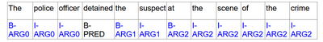
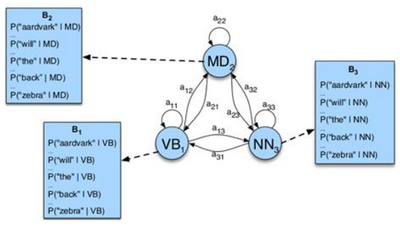
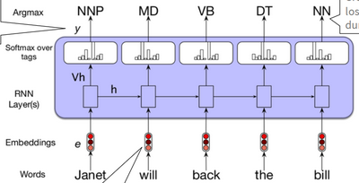
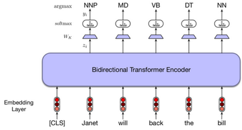

# W6 - Sequence Labelling

## Applications

### POS Tagging
The goal is to annotate spans using labels showing the word type of each token.
Classes are either:
- **Closed class** - Members of the class are fixed, e.g. pronouns.
- **Open class** - New words are likely to be added over time.
Often closed-class words are **function words**, which are for syntax, not meaning.
Universal Scheme and Penn Treebank are common tagsets.
Evaluation metric of choice is accuracy.

### Semantic Role Labelling
This is similar to POS tagging, but follows a predicate-argument structure.

PropBank and FrameNet are common schemes.

### Named Entity Recognition
This is identifying and labelling any named entities in the text, like:
- People
- Organisation
- Location
- Geo-politcal entity

Some tagging schemes include:
- IO, just labelling in-class and out.
- BIO, labelling begin-class, in-class, and out.
- BIOES, labelling begin, in, end-classes, single word classes, and out.

All of these methods can face ambiguity during the process.

## ML-based Approaches

### Hidden Markov Model
**Markov chain** - A sequence of events where the probability of any event only depends on the current state, and no others.
I.e. to predict the weather tomorrow, one should only consider today's weather.
**Hidden Markov Model** - Like a Markov chain, but the states are hidden and one must deduce probabilities from the emissions of states.
I.e. to predict the state of the weather now while indoors, one must consider factors like how noisy it is outside.
The POS tags are hidden, and the words (emission) are the result of them.

Goal: Generate the most probable sequence of hidden states (tags) given the sequence of observations (words).

### Conditional Random Fields
CRFs discriminate between all possible tag sequences. This means probabilities don't just rely on the previous state.
It uses features when calculating the probability of the output sequence given the input. Examples of features are:
- **Word shape** - Letter pattern of a given word, e.g. XXdd-dd, where x's are letters and d's are digits.
- **Short word shape** - Like word shape but without consecutive character types, e.g. Xd-d.
- **Affixes** - Prefixes or suffixes of any size.
- **Gazetteer** - Presence of a word in a dictionary.

This approach requires feature engineering, and was state-of-the-art before deep learning.
Not sure on how it works.

## Deep Learning Approaches
RNNs can take the input sequence as its word embedding and output probabilities for all possible tags, using softmax.

BERT can also be fine-tuned for sequence labelling.

Its common to have a CRF layer on top of a softmax on BERT.

These approaches require pre-trained embeddings or language models. Models cannot be interpreted well either.